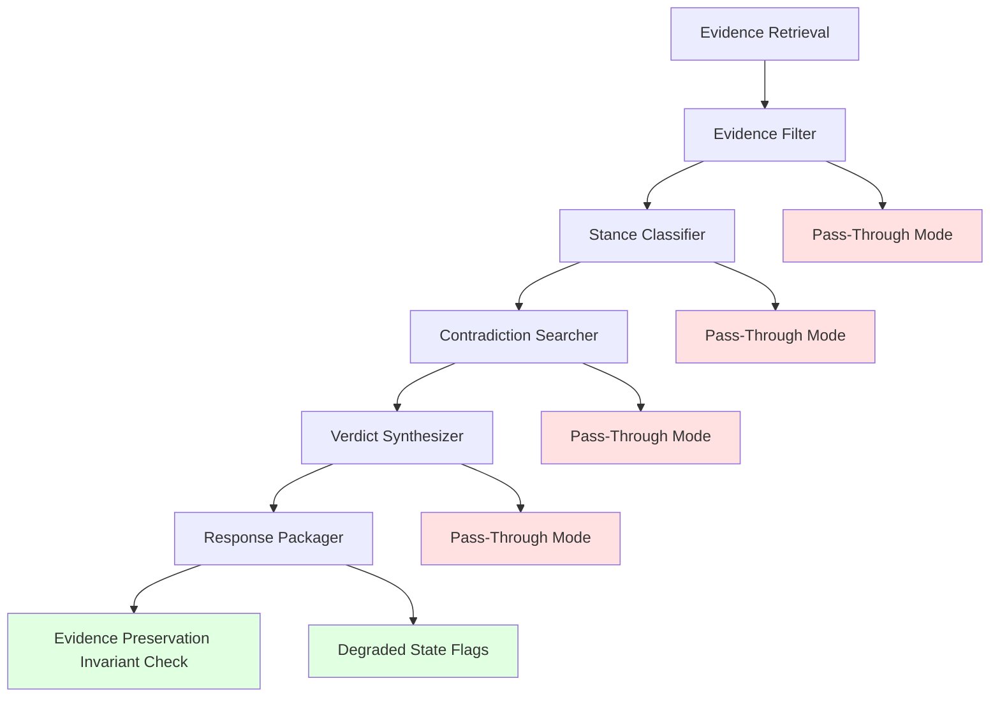

# Design Document: Evidence Preservation Architecture

## Overview

This design implements a comprehensive "preserve evidence first" architecture across the entire orchestration pipeline to ensure evidence is NEVER lost when Bedrock model invocation fails at any stage. This is Phase 2 of the evidence filter fix, building on Phase 1's immediate bug fix (NOVA model selection and pass-through fallback in evidenceFilter).

The core architectural principle is: **if evidence retrieval succeeds, that evidence must be preserved through response packaging even when downstream AI models fail**. No model failure is allowed to zero out already-retrieved evidence.

### Key Design Decisions

1. **Pass-Through Contract**: Every AI-dependent stage implements a consistent pass-through contract - if the AI model fails, preserve input evidence with neutral/default metadata
2. **Explicit Degraded State Tracking**: Track which stages used pass-through mode and what model failures occurred
3. **Evidence Preservation Invariant**: Log evidence counts before and after each stage to detect evidence loss
4. **Non-Breaking Extension**: Add new fields to API responses without modifying existing fields
5. **Diagnostic Logging**: Comprehensive logging at each stage boundary for debugging and monitoring

### Integration Points

- **Existing EvidenceOrchestrator**: Extend with pass-through fallback when filter fails
- **Existing EvidenceFilter**: Already has pass-through mode (Phase 1), extend logging
- **Existing SourceClassifier**: Add pass-through mode for stance classification failures
- **Existing VerdictSynthesizer**: Add pass-through mode for verdict synthesis failures
- **Existing ContradictionSearcher**: Add pass-through mode for contradiction search failures
- **Existing IterativeOrchestrationPipeline**: Add evidence count logging at stage boundaries

## Architecture

### System Components

### Data Flow

