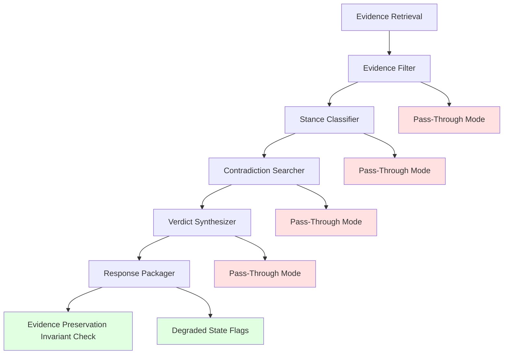

# Design Document: Evidence Preservation Architecture

## Overview

This design implements a comprehensive "preserve evidence first" architecture across the entire orchestration pipeline to ensure evidence is NEVER lost when Bedrock model invocation fails at any stage. This is Phase 2 of the evidence filter fix, building on Phase 1's immediate bug fix (NOVA model selection and pass-through fallback in evidenceFilter).

The core architectural principle is: **if evidence retrieval succeeds, that evidence must be preserved through response packaging even when downstream AI models fail**. No model failure is allowed to zero out already-retrieved evidence.

### Key Design Decisions

1. **Pass-Through Contract**: Every AI-dependent stage implements a consistent pass-through contract - if the AI model fails, preserve input evidence with neutral/default metadata
2. **Explicit Degraded State Tracking**: Track which stages used pass-through mode and what model failures occurred
3. **Evidence Preservation Invariant**: Log evidence counts before and after each stage to detect evidence loss
4. **Non-Breaking Extension**: Add new fields to API responses without modifying existing fields
5. **Diagnostic Logging**: Comprehensive logging at each stage boundary for debugging and monitoring

### Integration Points

- **Existing EvidenceOrchestrator**: Extend with pass-through fallback when filter fails
- **Existing EvidenceFilter**: Already has pass-through mode (Phase 1), extend logging
- **Existing SourceClassifier**: Add pass-through mode for stance classification failures
- **Existing VerdictSynthesizer**: Add pass-through mode for verdict synthesis failures
- **Existing ContradictionSearcher**: Add pass-through mode for contradiction search failures
- **Existing IterativeOrchestrationPipeline**: Add evidence count logging at stage boundaries

## Architecture

### System Components



### Data Flow


1. **Evidence Retrieval** → Providers return raw evidence
2. **Evidence Filter** → Scores and filters evidence using AI models
   - **Success**: Return enriched evidence with relevance scores
   - **Failure**: Pass through original evidence with neutral scores (0.7)
3. **Stance Classifier** → Classifies evidence stance (supports/contradicts/mentions)
   - **Success**: Return evidence with stance classifications
   - **Failure**: Pass through original evidence with neutral stance
4. **Contradiction Searcher** → Searches for contradictory evidence
   - **Success**: Return evidence with contradiction metadata
   - **Failure**: Pass through original evidence without contradiction metadata
5. **Verdict Synthesizer** → Generates final verdict
   - **Success**: Return synthesized verdict with evidence
   - **Failure**: Return degraded verdict with preserved evidence
6. **Response Packager** → Assembles final API response
   - **Always**: Log evidence counts before and after packaging
   - **Always**: Include degraded state flags if pass-through was used

### Component Interactions

- **EvidenceFilter** logs `FILTERED_SOURCES_COUNT` with pass/reject counts
- **SourceClassifier** logs stance classification results
- **IterativeOrchestrationPipeline** logs evidence counts at each stage boundary
- **Response Packager** validates evidence preservation invariant

## Components and Interfaces

### EvidenceFilter (Extended)

Extends existing EvidenceFilter with enhanced logging and pass-through mode.

```typescript
interface FilterResult {
  passed: FilteredEvidence[];
  rejected: FilteredEvidence[];
  fallbackUsed: boolean;
  modelFailure?: string;
}

class EvidenceFilter {
  async filter(
    candidates: EvidenceCandidate[],
    claim: string
  ): Promise<FilterResult>;
}
```

**Pass-Through Behavior**:
- When Bedrock model fails, preserve all candidates with neutral scores (0.7)
- Log `EVIDENCE_FILTER_FALLBACK` event with failure details
- Set `fallbackUsed = true` in result

### SourceClassifier (Extended)

Extends existing SourceClassifier with pass-through mode for stance classification failures.

```typescript
interface ClassificationResult {
  classified: ClassifiedSource[];
  fallbackUsed: boolean;
  modelFailure?: string;
}

class SourceClassifier {
  async classify(
    evidence: FilteredEvidence[]
  ): Promise<ClassificationResult>;
}
```

**Pass-Through Behavior**:
- When Bedrock model fails, preserve all evidence with neutral stance ("mentions")
- Log `STANCE_CLASSIFICATION_FALLBACK` event with failure details
- Set `fallbackUsed = true` in result


### ContradictionSearcher (Extended)

Extends existing ContradictionSearcher with pass-through mode for search failures.

```typescript
interface ContradictionSearchResult {
  evidence: FilteredEvidence[];
  foundContradictions: boolean;
  fallbackUsed: boolean;
  modelFailure?: string;
}

class ContradictionSearcher {
  async searchContradictions(
    claim: string,
    supportingEvidence: ClassifiedSource[]
  ): Promise<ContradictionSearchResult>;
}
```

**Pass-Through Behavior**:
- When Bedrock model fails, return empty contradiction evidence
- Log `CONTRADICTION_SEARCH_FALLBACK` event with failure details
- Set `fallbackUsed = true` in result

### VerdictSynthesizer (Extended)

Extends existing VerdictSynthesizer with pass-through mode for synthesis failures.

```typescript
interface SynthesisResult {
  verdict: Verdict;
  fallbackUsed: boolean;
  modelFailure?: string;
}

class VerdictSynthesizer {
  async synthesize(
    decomposition: ClaimDecomposition,
    evidenceBuckets: EvidenceBucket,
    contradictionResult: ContradictionResult
  ): Promise<SynthesisResult>;
}
```

**Pass-Through Behavior**:
- When Bedrock model fails, return degraded verdict with preserved evidence
- Verdict classification: "unverified"
- Confidence: 0
- Rationale: "Verdict synthesis failed - evidence preserved for manual review"
- Log `VERDICT_SYNTHESIS_FALLBACK` event with failure details
- Set `fallbackUsed = true` in result

### IterativeOrchestrationPipeline (Extended)

Extends existing pipeline with evidence count logging at each stage boundary.

```typescript
interface PipelineStageLog {
  stage: string;
  evidenceCountBefore: number;
  evidenceCountAfter: number;
  evidenceLost: number;
  fallbackUsed: boolean;
}

// New logging events
console.log({
  event: 'RETRIEVED_SOURCES_COUNT',
  count: number,
  // ... existing fields
});

console.log({
  event: 'FILTERED_SOURCES_COUNT',
  passed_count: number,
  rejected_count: number,
  fallback_used: boolean,
  // ... existing fields
});

console.log({
  event: 'BUCKETED_SOURCES_COUNT',
  supporting_count: number,
  contradicting_count: number,
  context_count: number,
  rejected_count: number,
  // ... existing fields
});

console.log({
  event: 'SOURCES_BEFORE_PACKAGING',
  count: number,
  // ... existing fields
});

console.log({
  event: 'SOURCES_AFTER_PACKAGING',
  count: number,
  // ... existing fields
});

console.log({
  event: 'EVIDENCE_PRESERVATION_INVARIANT',
  status: 'PASS' | 'FAIL',
  before_count: number,
  after_count: number,
  // ... existing fields
});
```


## Data Models

### Degraded State Metadata

```typescript
interface DegradedStateMetadata {
  /** Whether evidence preservation was triggered */
  evidencePreserved: boolean;
  /** Stages that used pass-through mode */
  degradedStages: string[];
  /** Model failures encountered */
  modelFailures: string[];
}
```

### Extended RetrievalStatus

```typescript
interface RetrievalStatus {
  // ... existing fields
  
  /** Evidence preservation flags (NEW) */
  evidencePreserved?: boolean;
  /** Degraded stages that used pass-through (NEW) */
  degradedStages?: string[];
  /** Model failures encountered (NEW) */
  modelFailures?: string[];
}
```

### Evidence Preservation Invariant

The evidence preservation invariant is a rule that must hold at all times:

**Invariant**: If `LIVE_SOURCES_BEFORE_PACKAGING` > 0, then `LIVE_SOURCES_AFTER_PACKAGING` > 0

Where:
- `LIVE_SOURCES_BEFORE_PACKAGING` = supporting + contradicting + context sources
- `LIVE_SOURCES_AFTER_PACKAGING` = final source count in API response

**Validation**:
```typescript
if (liveSourcesBeforePackaging > 0 && liveSourcesAfterPackaging === 0) {
  console.log({
    level: 'ERROR',
    event: 'EVIDENCE_PRESERVATION_INVARIANT',
    status: 'FAIL',
    before_count: liveSourcesBeforePackaging,
    after_count: liveSourcesAfterPackaging,
    message: 'INVARIANT VIOLATION: Evidence was lost during packaging'
  });
} else {
  console.log({
    level: 'INFO',
    event: 'EVIDENCE_PRESERVATION_INVARIANT',
    status: 'PASS',
    before_count: liveSourcesBeforePackaging,
    after_count: liveSourcesAfterPackaging
  });
}
```

## Correctness Properties

*A property is a characteristic or behavior that should hold true across all valid executions of a system—essentially, a formal statement about what the system should do. Properties serve as the bridge between human-readable specifications and machine-verifiable correctness guarantees.*

### Property 1: Evidence Filter Pass-Through

*For any* evidence retrieval that succeeds AND evidence filter model fails, the response packager SHALL include the retrieved evidence with default metadata.

**Validates: Requirement 1.1**

### Property 2: Stance Classifier Pass-Through

*For any* evidence retrieval that succeeds AND stance classifier model fails, the response packager SHALL include the retrieved evidence with neutral stance metadata.

**Validates: Requirement 1.2**

### Property 3: Verdict Synthesizer Pass-Through

*For any* evidence retrieval that succeeds AND verdict synthesizer model fails, the response packager SHALL include the retrieved evidence with a degraded verdict.

**Validates: Requirement 1.3**

### Property 4: Contradiction Searcher Pass-Through

*For any* evidence retrieval that succeeds AND contradiction searcher fails, the response packager SHALL include the retrieved evidence without contradiction metadata.

**Validates: Requirement 1.4**


### Property 5: No Evidence Loss from Model Failures

*For any* evidence retrieval that succeeds AND any downstream Bedrock model fails, the response packager SHALL NOT return empty sources.

**Validates: Requirement 1.5**

### Property 6: Evidence Preservation Invariant

*For any* pipeline execution where `LIVE_SOURCES_BEFORE_PACKAGING` > 0, then `LIVE_SOURCES_AFTER_PACKAGING` > 0 unless explicit business rules removed sources.

**Validates: Requirement 4.4**

### Property 7: Degraded State Flags Presence

*For any* pipeline execution where pass-through mode was used, the API response SHALL include `retrieval_status.degradedStages` array and `retrieval_status.evidencePreserved` boolean.

**Validates: Requirement 3.1, 3.2, 3.3**

### Property 8: Model Failure Tracking

*For any* pipeline execution where a Bedrock model fails, the API response SHALL include the failure details in `retrieval_status.modelFailures` array.

**Validates: Requirement 3.3**

### Property 9: Backward Compatibility

*For any* existing client code, the addition of new fields to API responses SHALL NOT break existing functionality.

**Validates: Requirement 8.5**

## Error Handling

### Error Categories

1. **Bedrock Model Errors**
   - Timeout: Activate pass-through mode, preserve evidence
   - Rate limit: Activate pass-through mode, preserve evidence
   - Invalid response: Activate pass-through mode, preserve evidence
   - Service unavailable: Activate pass-through mode, preserve evidence

2. **Evidence Preservation Errors**
   - Evidence lost during packaging: Log ERROR, investigate root cause
   - Invariant violation: Log ERROR, include diagnostic information
   - Pass-through mode activation: Log WARN, include stage and reason

### Error Recovery Strategies

```typescript
interface ErrorRecovery {
  // Activate pass-through mode for AI-dependent stage
  activatePassThrough(
    stage: string,
    evidence: any[],
    error: Error
  ): { result: any; fallbackUsed: boolean; modelFailure: string };
  
  // Validate evidence preservation invariant
  validateInvariant(
    beforeCount: number,
    afterCount: number
  ): { status: 'PASS' | 'FAIL'; message: string };
  
  // Track degraded state
  trackDegradedState(
    stage: string,
    modelFailure: string
  ): void;
}
```

## Testing Strategy

### Dual Testing Approach

This feature requires both unit tests and property-based tests for comprehensive coverage:

**Unit Tests** focus on:
- Specific model failure scenarios (timeout, rate limit, invalid response)
- Pass-through mode activation for each stage
- Evidence preservation invariant validation
- Degraded state flag generation
- API response structure with new fields

**Property-Based Tests** focus on:
- Universal properties across all inputs (see Correctness Properties section)
- Randomized model failure injection
- Comprehensive evidence preservation scenarios
- Invariant validation across random pipeline states


### Property-Based Testing Configuration

**Library**: Use `fast-check` for TypeScript property-based testing

**Configuration**:
- Minimum 100 iterations per property test
- Each test must reference its design document property
- Tag format: `Feature: evidence-preservation-architecture, Property {number}: {property_text}`

**Example Property Test Structure**:

```typescript
import fc from 'fast-check';

describe('Property 1: Evidence Filter Pass-Through', () => {
  it('should preserve evidence when filter model fails', async () => {
    // Feature: evidence-preservation-architecture, Property 1: Evidence Filter Pass-Through
    await fc.assert(
      fc.asyncProperty(
        evidenceRetrievalSuccessArbitrary(),
        async (retrievalResult) => {
          // Simulate filter model failure
          const mockFilter = createMockFilterWithFailure();
          
          const result = await pipeline.execute(retrievalResult, mockFilter);
          
          // Verify evidence preserved with default metadata
          expect(result.sources.length).toBeGreaterThan(0);
          expect(result.retrievalStatus.evidencePreserved).toBe(true);
          expect(result.retrievalStatus.degradedStages).toContain('evidenceFilter');
        }
      ),
      { numRuns: 100 }
    );
  });
});
```

### Test Data Generators

Create arbitraries for:
- Evidence retrieval results (success with various source counts)
- Model failure scenarios (timeout, rate limit, invalid response)
- Pipeline states at different stages
- Evidence buckets with various distributions

### Integration Testing

Test the complete pipeline with:
- Simulated model failures at each stage
- Real evidence retrieval with mocked AI models
- End-to-end evidence preservation validation
- Performance benchmarks (overhead < 5%)

### Mocking Strategy

For unit tests, mock:
- Bedrock client responses (simulate failures)
- Evidence retrieval results (deterministic test data)
- AI model invocations (controlled failure injection)

For property tests, use:
- Real implementations where possible
- Mocks only for external dependencies (Bedrock, providers)
- Deterministic mocks that respect property invariants

## Algorithms

### Pass-Through Mode Activation

```typescript
async function executeWithPassThrough<T>(
  stage: string,
  evidence: any[],
  operation: () => Promise<T>,
  fallbackFn: (evidence: any[]) => T
): Promise<{ result: T; fallbackUsed: boolean; modelFailure?: string }> {
  try {
    const result = await operation();
    return { result, fallbackUsed: false };
  } catch (error) {
    console.log({
      level: 'WARN',
      event: `${stage.toUpperCase()}_FALLBACK`,
      message: `${stage} model failed - activating pass-through preservation`,
      error_message: error.message,
      evidence_count: evidence.length
    });
    
    const result = fallbackFn(evidence);
    return {
      result,
      fallbackUsed: true,
      modelFailure: `${stage} model failed: ${error.message}`
    };
  }
}
```


### Evidence Preservation Invariant Validation

```typescript
function validateEvidencePreservationInvariant(
  liveSourcesBeforePackaging: number,
  liveSourcesAfterPackaging: number
): { status: 'PASS' | 'FAIL'; message: string } {
  if (liveSourcesBeforePackaging > 0 && liveSourcesAfterPackaging === 0) {
    const message = 'INVARIANT VIOLATION: Evidence was lost during packaging';
    console.log({
      level: 'ERROR',
      event: 'EVIDENCE_PRESERVATION_INVARIANT',
      status: 'FAIL',
      before_count: liveSourcesBeforePackaging,
      after_count: liveSourcesAfterPackaging,
      message
    });
    return { status: 'FAIL', message };
  } else {
    console.log({
      level: 'INFO',
      event: 'EVIDENCE_PRESERVATION_INVARIANT',
      status: 'PASS',
      before_count: liveSourcesBeforePackaging,
      after_count: liveSourcesAfterPackaging
    });
    return { status: 'PASS', message: 'Evidence preservation invariant satisfied' };
  }
}
```

### Degraded State Tracking

```typescript
class DegradedStateTracker {
  private degradedStages: string[] = [];
  private modelFailures: string[] = [];
  private evidencePreserved: boolean = false;
  
  trackStage(stage: string, modelFailure: string): void {
    this.degradedStages.push(stage);
    this.modelFailures.push(modelFailure);
    this.evidencePreserved = true;
  }
  
  getMetadata(): DegradedStateMetadata {
    return {
      evidencePreserved: this.evidencePreserved,
      degradedStages: this.degradedStages,
      modelFailures: this.modelFailures
    };
  }
  
  hasAnyDegradation(): boolean {
    return this.degradedStages.length > 0;
  }
}
```

## Performance Considerations

### Logging Overhead

- Diagnostic logging adds < 1ms per log statement
- Total overhead for 5 new log events: < 5ms
- Acceptable given total pipeline latency (typically 2-5 seconds)

### Pass-Through Mode Overhead

- Pass-through mode eliminates AI model call latency
- Fallback logic adds < 1ms per stage
- Net effect: faster execution when models fail

### Memory Overhead

- Degraded state tracking: < 1KB per request
- Evidence preservation: no additional memory (reuses existing evidence)
- Negligible impact on Lambda memory usage

## Deployment Strategy

### Phased Rollout

1. **Phase 1**: Deploy diagnostic logging only (already complete)
2. **Phase 2**: Deploy pass-through modes for all stages (this spec)
3. **Phase 3**: Monitor degraded state metrics in production
4. **Phase 4**: Tune pass-through thresholds based on metrics

### Monitoring

Track the following metrics:
- `evidencePreserved` flag frequency
- `degradedStages` distribution (which stages fail most often)
- `modelFailures` patterns (timeout vs rate limit vs invalid response)
- Evidence preservation invariant violations (should be zero)

### Rollback Plan

If issues arise:
1. Disable pass-through modes via feature flag
2. Revert to Phase 1 (diagnostic logging only)
3. Investigate root cause
4. Fix and redeploy

## Documentation

### API Response Changes

Document new fields in API response:

```typescript
interface AnalysisResponse {
  // ... existing fields
  
  retrieval_status: {
    // ... existing fields
    
    /** Whether evidence preservation was triggered (NEW) */
    evidencePreserved?: boolean;
    /** Stages that used pass-through mode (NEW) */
    degradedStages?: string[];
    /** Model failures encountered (NEW) */
    modelFailures?: string[];
  };
}
```

### Developer Guide

Provide guidance on:
- How to interpret degraded state flags
- How to debug evidence preservation issues
- How to add pass-through mode to new stages
- How to validate evidence preservation invariant

