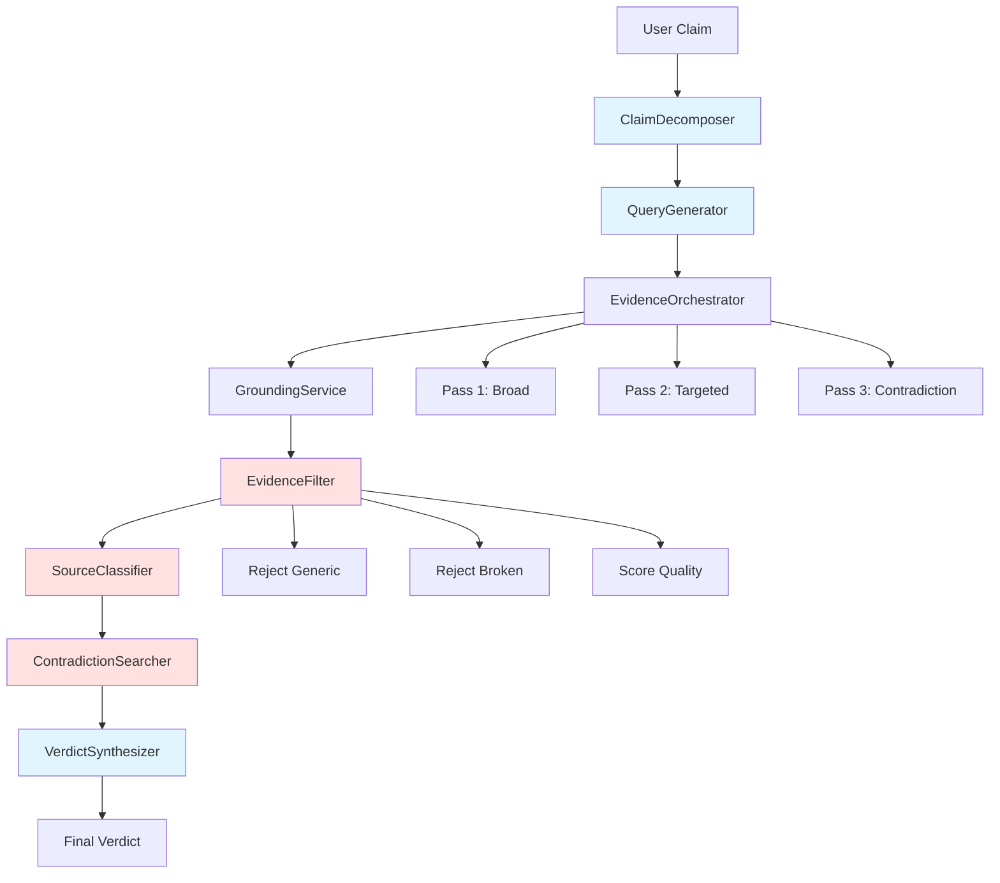

# Design Document: Iterative Evidence Orchestration

## Overview

This design transforms FakeNewsOff's truth-analysis pipeline from shallow single-pass retrieval into a multi-stage evidence orchestration system. The current system returns generic homepage links, broken pages, and over-relies on repeated domains. This redesign implements iterative retrieval with quality filtering, source diversity enforcement, and active contradiction search to produce jury-grade truth analysis.

The core architectural principle is: **optimize for returning the strongest, most relevant, non-broken, claim-specific evidence** rather than simply returning some sources.

### Key Design Decisions

1. **NOVA as Reasoning Coordinator**: Use NOVA for all reasoning tasks (claim decomposition, query generation, evidence classification, contradiction analysis, verdict synthesis) rather than implementing heuristic algorithms
2. **Multi-Pass Retrieval**: Execute 3 retrieval passes with progressive refinement (broad → targeted → contradiction/primary)
3. **Quality-First Filtering**: Reject generic pages, broken links, and unrelated content before scoring
4. **Source Diversity Enforcement**: Require multiple source classes in final evidence set
5. **Round-Trip Verification**: Verify evidence content actually addresses the claim, not just keyword matching

### Integration Points

- **Existing GroundingService**: Reuse for news retrieval (Bing/GDELT providers)
- **Existing NovaClient**: Extend for new reasoning tasks (decomposition, classification, synthesis)
- **Existing QueryBuilder**: Replace with NOVA-generated queries
- **New EvidenceOrchestrator**: Coordinate multi-pass retrieval and filtering

## Architecture

### System Components



### Data Flow

1. **Claim Input** → ClaimDecomposer extracts subclaims using NOVA
2. **Subclaims** → QueryGenerator creates multiple query types per subclaim using NOVA
3. **Queries** → EvidenceOrchestrator executes multi-pass retrieval:
   - Pass 1: Broad searches across all queries
   - Pass 2: Targeted searches using strongest entities/dates/gaps
   - Pass 3: Contradiction and primary source searches
4. **Raw Evidence** → EvidenceFilter rejects low-quality candidates using NOVA
5. **Filtered Evidence** → SourceClassifier categorizes by type (primary, secondary, etc.)
6. **Classified Evidence** → ContradictionSearcher actively seeks disconfirming evidence
7. **Evidence Buckets** → VerdictSynthesizer produces final analysis using NOVA

### Component Interactions

- **ClaimDecomposer** calls NovaClient with decomposition prompt
- **QueryGenerator** calls NovaClient with query generation prompt
- **EvidenceOrchestrator** calls GroundingService for each query, manages iteration
- **EvidenceFilter** calls NovaClient for classification and scoring
- **SourceClassifier** uses domain patterns and NOVA for classification
- **ContradictionSearcher** generates contradiction queries via NovaClient
- **VerdictSynthesizer** calls NovaClient with all evidence for final synthesis

## Components and Interfaces

### ClaimDecomposer

Extracts verifiable subclaims from user input using NOVA.

```typescript
interface Subclaim {
  type: 'actor' | 'action' | 'object' | 'place' | 'time' | 'certainty' | 'causal';
  text: string;
  confidence: number;
}

interface ClaimDecomposition {
  originalClaim: string;
  subclaims: Subclaim[];
  mainActors: string[];
  mainActions: string[];
  temporalContext?: {
    hasTimeReference: boolean;
    timeframe?: string;
  };
}

class ClaimDecomposer {
  constructor(private novaClient: NovaClient) {}
  
  async decompose(claim: string): Promise<ClaimDecomposition>;
}
```

**NOVA Prompt Strategy**: Provide claim text and request structured extraction of actors, actions, objects, places, times, certainty indicators, and causal relationships. Use JSON schema for response format.

### QueryGenerator

Generates multiple search query types per subclaim using NOVA.

```typescript
interface Query {
  text: string;
  type: 'exact' | 'entity_action' | 'date_sensitive' | 'official_confirmation' | 
        'contradiction' | 'primary_source' | 'regional' | 'fact_check';
  priority: number;
  targetSourceClass?: SourceClass;
}

interface QuerySet {
  queries: Query[];
  metadata: {
    subclaim: Subclaim;
    generatedAt: string;
  };
}

class QueryGenerator {
  constructor(private novaClient: NovaClient) {}
  
  async generateQueries(decomposition: ClaimDecomposition): Promise<QuerySet[]>;
}
```

**NOVA Prompt Strategy**: Provide subclaims and request diverse query formulations targeting different source types. Include examples of effective queries for each type.

### EvidenceOrchestrator

Coordinates multi-pass retrieval with progressive refinement.

```typescript
interface RetrievalPass {
  passNumber: 1 | 2 | 3;
  queries: Query[];
  strategy: 'broad' | 'targeted' | 'contradiction_primary';
}

interface OrchestrationConfig {
  minEvidenceScore: number;
  minSourceDiversity: number;
  maxRetrievalPasses: number;
  requirePrimarySource: boolean;
  rejectGenericPages: boolean;
  contradictionSearchRequired: boolean;
}

interface OrchestrationResult {
  evidenceCandidates: EvidenceCandidate[];
  passesExecuted: number;
  stoppingReason: 'quality_threshold' | 'max_passes' | 'no_improvement';
  metrics: {
    totalQueriesExecuted: number;
    totalCandidatesRetrieved: number;
    candidatesAfterFiltering: number;
  };
}

class EvidenceOrchestrator {
  constructor(
    private groundingService: GroundingService,
    private evidenceFilter: EvidenceFilter,
    private config: OrchestrationConfig
  ) {}
  
  async orchestrate(querySets: QuerySet[]): Promise<OrchestrationResult>;
  
  private async executePass(pass: RetrievalPass): Promise<EvidenceCandidate[]>;
  private shouldContinue(currentEvidence: EvidenceCandidate[], passNumber: number): boolean;
  private buildNextPass(currentEvidence: EvidenceCandidate[], passNumber: number): RetrievalPass;
}
```

**Iteration Logic**:
- Pass 1: Execute all broad queries (exact, entity_action, date_sensitive)
- Pass 2: If quality threshold not met, execute targeted queries using strongest entities/dates and fill source gaps
- Pass 3: If still needed, execute contradiction and primary source queries
- Stop early if quality threshold reached or no improvement detected

### EvidenceFilter

Validates and scores evidence quality using NOVA.

```typescript
type PageType = 'article' | 'homepage' | 'category' | 'tag' | 'search' | 'broken' | 'unrelated';

interface EvidenceCandidate {
  url: string;
  title: string;
  snippet: string;
  domain: string;
  publishDate: string;
  query: Query;
  rawScore: number;
}

interface FilteredEvidence extends EvidenceCandidate {
  pageType: PageType;
  qualityScore: QualityScore;
  relevantContent?: string;
  rejectionReason?: string;
}

interface QualityScore {
  overall: number; // 0-1
  dimensions: {
    claimRelevance: number;
    specificity: number;
    directness: number;
    freshness: number;
    authority: number;
    primaryVsSecondary: number;
    contradictionValue: number;
    corroborationCount: number;
    accessibility: number;
    extractability: number;
    geographicRelevance: number;
  };
}

class EvidenceFilter {
  constructor(private novaClient: NovaClient) {}
  
  async filter(candidates: EvidenceCandidate[], claim: string): Promise<FilteredEvidence[]>;
  async classifyPageType(candidate: EvidenceCandidate): Promise<PageType>;
  async scoreQuality(candidate: EvidenceCandidate, claim: string): Promise<QualityScore>;
  async verifyContent(candidate: EvidenceCandidate, claim: string): Promise<{
    verified: boolean;
    relevantContent?: string;
  }>;
}
```

**NOVA Prompt Strategy**: 
- Page classification: Provide URL, title, snippet and request classification
- Quality scoring: Provide claim, evidence, and request multi-dimensional scores
- Content verification: Provide claim and evidence content, verify actual relevance beyond keywords

**Rejection Rules**:
- Reject if pageType is 'homepage', 'category', 'tag', 'search', or 'broken'
- Reject if qualityScore.overall < config.minEvidenceScore
- Reject if content verification fails

### SourceClassifier

Categorizes sources by type and authority.

```typescript
type SourceClass = 
  | 'primary_official'      // Government, military, embassy, press office
  | 'primary_direct'        // Direct speech, transcript, court document
  | 'secondary_major'       // Major international reporting (Reuters, AP, BBC, etc.)
  | 'secondary_regional'    // Regional/local media
  | 'secondary_factcheck'   // Fact-checking organizations
  | 'tertiary_analysis';    // Opinion, analysis, commentary

interface ClassifiedSource extends FilteredEvidence {
  sourceClass: SourceClass;
  authorityLevel: 'high' | 'medium' | 'low';
  isPrimarySource: boolean;
}

class SourceClassifier {
  constructor(private novaClient: NovaClient) {}
  
  async classify(evidence: FilteredEvidence[]): Promise<ClassifiedSource[]>;
  private classifyByDomain(domain: string): SourceClass;
  private async classifyByContent(evidence: FilteredEvidence): Promise<SourceClass>;
}
```

**Classification Strategy**:
1. Domain-based classification for known sources (government domains, major news outlets)
2. NOVA-based classification for unknown sources (analyze content type)
3. Authority level based on source class and domain reputation

### ContradictionSearcher

Actively seeks disconfirming evidence.

```typescript
interface ContradictionQuery extends Query {
  type: 'contradiction';
  targetClaim: string;
}

interface ContradictionResult {
  contradictoryEvidence: ClassifiedSource[];
  contradictionStrength: 'strong' | 'moderate' | 'weak' | 'none';
  analysis: string;
}

class ContradictionSearcher {
  constructor(
    private novaClient: NovaClient,
    private groundingService: GroundingService,
    private evidenceFilter: EvidenceFilter
  ) {}
  
  async searchContradictions(
    claim: string,
    supportingEvidence: ClassifiedSource[]
  ): Promise<ContradictionResult>;
  
  private async generateContradictionQueries(claim: string): Promise<ContradictionQuery[]>;
}
```

**NOVA Prompt Strategy**: Generate queries that would find evidence disproving the claim (e.g., "claim X debunked", "claim X false", "evidence against X").

### VerdictSynthesizer

Produces final analysis with confidence and rationale using NOVA.

```typescript
type VerdictClassification = 
  | 'strongly_supported'
  | 'supported'
  | 'mixed_evidence'
  | 'unsupported'
  | 'contradicted'
  | 'insufficient_evidence';

interface Verdict {
  classification: VerdictClassification;
  confidence: number; // 0-100
  supportedSubclaims: Subclaim[];
  unsupportedSubclaims: Subclaim[];
  contradictoryEvidenceSummary: string;
  unresolvedUncertainties: string[];
  bestEvidence: ClassifiedSource[];
  rejectedEvidence: Array<{
    source: FilteredEvidence;
    reason: string;
  }>;
  rationale: string;
  synthesisMetadata: {
    totalSourcesAnalyzed: number;
    sourceDiversityScore: number;
    primarySourcesUsed: number;
    contradictionSearchPerformed: boolean;
  };
}

class VerdictSynthesizer {
  constructor(private novaClient: NovaClient) {}
  
  async synthesize(
    decomposition: ClaimDecomposition,
    supportingEvidence: ClassifiedSource[],
    contradictionResult: ContradictionResult,
    rejectedEvidence: FilteredEvidence[]
  ): Promise<Verdict>;
}
```

**NOVA Prompt Strategy**: Provide all evidence (supporting, contradicting, rejected), subclaims, and request comprehensive analysis with confidence scoring and rationale.

## Data Models

### Core Data Structures

```typescript
// Evidence bucket for organizing by stance
interface EvidenceBucket {
  supporting: ClassifiedSource[];
  contradicting: ClassifiedSource[];
  unclear: ClassifiedSource[];
}

// Pipeline state for tracking progress
interface PipelineState {
  claim: string;
  decomposition: ClaimDecomposition;
  querySets: QuerySet[];
  orchestrationResult: OrchestrationResult;
  evidenceBucket: EvidenceBucket;
  contradictionResult: ContradictionResult;
  verdict: Verdict;
  logs: PipelineLog[];
}

// Structured logging
interface PipelineLog {
  timestamp: string;
  stage: 'decomposition' | 'query_generation' | 'retrieval' | 'filtering' | 
         'classification' | 'contradiction' | 'synthesis';
  event: string;
  data: Record<string, any>;
}

// Configuration
interface PipelineConfig extends OrchestrationConfig {
  novaTimeoutMs: number;
  novaMaxRetries: number;
  groundingTimeoutMs: number;
  enableDebugLogs: boolean;
}
```

### Database Schema (if persistence needed)

```typescript
// DynamoDB table for caching NOVA responses
interface NovaResponseCache {
  cacheKey: string; // PK: hash of prompt
  responseType: string; // SK: 'decomposition' | 'query_gen' | 'classification' | 'synthesis'
  response: string;
  ttl: number;
  createdAt: string;
}

// DynamoDB table for pipeline runs (observability)
interface PipelineRun {
  runId: string; // PK
  claim: string;
  verdict: Verdict;
  metrics: {
    totalLatencyMs: number;
    novaCallCount: number;
    groundingCallCount: number;
    evidenceCandidatesRetrieved: number;
    evidenceCandidatesKept: number;
  };
  createdAt: string;
}
```


## Correctness Properties

*A property is a characteristic or behavior that should hold true across all valid executions of a system—essentially, a formal statement about what the system should do. Properties serve as the bridge between human-readable specifications and machine-verifiable correctness guarantees.*

### Property Reflection

After analyzing all acceptance criteria, I identified the following redundancies and consolidations:

- **Claim decomposition properties (1.1-1.7)**: Can be consolidated into a single property about complete decomposition
- **Query generation properties (2.1-2.8)**: Can be consolidated into properties about query diversity and type coverage
- **Source class retrieval (3.1-3.12)**: Can be consolidated into a property about source class diversity
- **Generic page rejection (4.1-4.5)**: Can be consolidated into a single property about generic page filtering
- **Broken page rejection (4.6-4.7, 11.1-11.3)**: Can be consolidated into a single property about accessibility filtering
- **Primary source prioritization (5.1-5.12)**: Can be consolidated into a property about prioritization logic
- **Evidence stages (6.1-6.3)**: These are specific examples of orchestration stages, not general properties
- **Retrieval passes (7.2-7.7)**: Can be consolidated into properties about iterative refinement
- **Evidence scoring (8.1-8.12)**: Can be consolidated into a property about score completeness
- **Source diversity rules (9.1-9.6)**: Can be consolidated into a property about final evidence diversity
- **Verdict completeness (10.1-10.8)**: Can be consolidated into a property about verdict structure
- **Evidence categorization (12.1-12.6)**: Can be consolidated into a property about evidence classification
- **Logging (13.1-13.7)**: Can be consolidated into a property about observability
- **Configuration (14.1-14.6)**: Can be consolidated into a property about configuration respect

### Property 1: Claim Decomposition Completeness

*For any* claim containing identifiable actors, actions, objects, places, times, certainty indicators, or causal relationships, the ClaimDecomposer should extract all present subclaim types with appropriate confidence scores.

**Validates: Requirements 1.1, 1.2, 1.3, 1.4, 1.5, 1.6, 1.7**

### Property 2: Query Type Diversity

*For any* claim decomposition, the QueryGenerator should produce queries covering multiple query types (exact, entity_action, date_sensitive, official_confirmation, contradiction, primary_source, regional, fact_check) appropriate to the subclaims present.

**Validates: Requirements 2.1, 2.2, 2.3, 2.4, 2.5, 2.6, 2.7, 2.8**

### Property 3: Source Class Retrieval Diversity

*For any* query set, the EvidenceOrchestrator should attempt retrieval targeting multiple source classes (major international, official government, military, embassy, press office, international organization, local media, regional media, fact-checking, direct speech, transcript, archival).

**Validates: Requirements 3.1, 3.2, 3.3, 3.4, 3.5, 3.6, 3.7, 3.8, 3.9, 3.10, 3.11, 3.12**


### Property 4: Generic Page Rejection

*For any* evidence candidate classified as a homepage, category page, tag page, latest news landing page, or search page, the EvidenceFilter should reject it from the final evidence set.

**Validates: Requirements 4.1, 4.2, 4.3, 4.4, 4.5**

### Property 5: Broken Page Rejection

*For any* evidence candidate that returns 404 status, is unavailable, or fails to load, the EvidenceFilter should exclude it from the final evidence set.

**Validates: Requirements 4.6, 4.7, 11.1, 11.2, 11.3**

### Property 6: Content Relevance Filtering

*For any* evidence candidate with content unrelated to the claim, duplicate content, or content that is too vague, the EvidenceFilter should reject it from the final evidence set.

**Validates: Requirements 4.8, 4.9, 4.10**

### Property 7: Primary Source Prioritization

*For any* claim involving official events (military action, official decisions, sanctions, elections, treaties, arrests, public health, corporate announcements, legal rulings, government action, public statements), evidence from primary sources (official releases, statements, court documents, agency notices, transcripts) should be ranked higher than secondary sources.

**Validates: Requirements 5.1, 5.2, 5.3, 5.4, 5.5, 5.6, 5.7, 5.8, 5.9, 5.10, 5.11, 5.12**

### Property 8: Contradictory Evidence Inclusion

*For any* verdict where contradictory evidence was found during orchestration, the VerdictSynthesizer should include that contradictory evidence in the final analysis.

**Validates: Requirements 6.4**

### Property 9: Iterative Refinement Stopping Conditions

*For any* orchestration run, retrieval should stop when one of three conditions is met: (1) evidence quality threshold is reached, (2) maximum passes are reached, or (3) repeated retrieval yields no improvement in evidence quality.

**Validates: Requirements 7.8, 7.9, 7.10**

### Property 10: Multi-Pass Progression

*For any* orchestration run where the first pass does not meet the quality threshold, a second pass should be executed using targeted strategies (strongest entities, dates, source gaps), and if still needed, a third pass should execute contradiction and primary source searches.

**Validates: Requirements 7.2, 7.3, 7.4, 7.5, 7.6, 7.7**


### Property 11: Evidence Score Completeness

*For any* evidence candidate that passes initial filtering, the EvidenceFilter should produce a quality score containing all required dimensions (claimRelevance, specificity, directness, freshness, authority, primaryVsSecondary, contradictionValue, corroborationCount, accessibility, extractability, geographicRelevance).

**Validates: Requirements 8.1, 8.2, 8.3, 8.4, 8.5, 8.6, 8.7, 8.8, 8.9, 8.10, 8.11**

### Property 12: Final Evidence Diversity

*For any* final evidence set, when sources of different classes are available (primary sources, official sources, major independent reporting, contradiction sources, nuance sources, geographically relevant sources), the set should include at least one source from each available class, subject to quality thresholds.

**Validates: Requirements 9.1, 9.2, 9.3, 9.4, 9.5, 9.6**

### Property 13: Verdict Structure Completeness

*For any* completed evidence collection, the VerdictSynthesizer should return a verdict containing all required fields: classification, confidence level, supported subclaims, unsupported subclaims, contradictory evidence summary, unresolved uncertainties, best evidence list, and rejection reasons.

**Validates: Requirements 10.1, 10.2, 10.3, 10.4, 10.5, 10.6, 10.7, 10.8**

### Property 14: Evidence Categorization

*For any* final evidence set, each piece of evidence should be categorized by type (strong supporting, strong contradicting, context/background, rejected candidate, primary source, remaining unknown) for user-facing display.

**Validates: Requirements 12.1, 12.2, 12.3, 12.4, 12.5, 12.6**

### Property 15: Pipeline Observability

*For any* pipeline execution, structured logs should be generated for each major stage (claim decomposition, query generation, evidence retrieval, evidence rejection, evidence kept, contradiction search, verdict production) with relevant data.

**Validates: Requirements 13.1, 13.2, 13.3, 13.4, 13.5, 13.6, 13.7**

### Property 16: Configuration Respect

*For any* pipeline execution with specified configuration values (minimum evidence score, minimum source diversity, maximum retrieval passes, require primary source, reject generic pages, contradiction search required), the pipeline should respect those configuration values in its behavior.

**Validates: Requirements 14.1, 14.2, 14.3, 14.4, 14.5, 14.6**


### Property 17: Content Extraction and Verification

*For any* evidence candidate that passes page type filtering, the EvidenceFilter should extract relevant content from the page and verify that the content addresses the claim beyond simple keyword matching.

**Validates: Requirements 16.1, 16.2, 16.3**

### Property 18: Verdict Consistency (Round-Trip)

*For any* final verdict with supporting evidence, if we take that evidence and re-analyze the original claim, the system should produce a verdict with the same classification (allowing for minor confidence score variations due to non-determinism).

**Validates: Requirements 16.4**

## Error Handling

### Error Categories

1. **NOVA Service Errors**
   - Timeout: Retry with exponential backoff (max 3 retries)
   - Rate limit: Implement token bucket with queue
   - Invalid response: Log error, use fallback heuristics where possible
   - Service unavailable: Fail gracefully with partial results

2. **Grounding Service Errors**
   - Provider timeout: Fall back to next provider in chain
   - Zero results: Continue with next query or pass
   - Invalid response: Log and skip candidate
   - All providers failed: Return insufficient evidence verdict

3. **Evidence Filtering Errors**
   - Page fetch failure: Mark as broken, reject candidate
   - Content extraction failure: Log warning, use title/snippet only
   - Classification failure: Use conservative fallback (mark as unclear)
   - Scoring failure: Use default low score

4. **Pipeline Errors**
   - Decomposition failure: Fall back to treating entire claim as single subclaim
   - Query generation failure: Use simple keyword extraction
   - Orchestration failure: Return partial results with error indication
   - Synthesis failure: Return raw evidence with minimal analysis

### Error Recovery Strategies

```typescript
interface ErrorRecovery {
  // Retry with exponential backoff
  retryWithBackoff(fn: () => Promise<any>, maxRetries: number): Promise<any>;
  
  // Circuit breaker for NOVA calls
  circuitBreaker(fn: () => Promise<any>, threshold: number): Promise<any>;
  
  // Graceful degradation
  fallbackToHeuristics(error: Error, context: any): any;
  
  // Partial result handling
  returnPartialResults(completedStages: PipelineState): Verdict;
}
```

### Error Logging

All errors should be logged with:
- Error type and message
- Stage where error occurred
- Input context (claim, query, candidate)
- Recovery action taken
- Impact on final result


## Testing Strategy

### Dual Testing Approach

This feature requires both unit tests and property-based tests for comprehensive coverage:

**Unit Tests** focus on:
- Specific examples of claim decomposition (e.g., "President announces policy" → actors, actions)
- Edge cases (empty claims, malformed input, special characters)
- Error conditions (NOVA timeout, grounding failure, broken links)
- Integration points (NOVA client mocking, grounding service mocking)
- Configuration validation

**Property-Based Tests** focus on:
- Universal properties across all inputs (see Correctness Properties section)
- Randomized claim generation with known structure
- Randomized evidence candidate generation
- Comprehensive input coverage through iteration

### Property-Based Testing Configuration

**Library**: Use `fast-check` for TypeScript property-based testing

**Configuration**:
- Minimum 100 iterations per property test
- Each test must reference its design document property
- Tag format: `Feature: iterative-evidence-orchestration, Property {number}: {property_text}`

**Example Property Test Structure**:

```typescript
import fc from 'fast-check';

describe('Property 1: Claim Decomposition Completeness', () => {
  it('should extract all present subclaim types', async () => {
    // Feature: iterative-evidence-orchestration, Property 1: Claim Decomposition Completeness
    await fc.assert(
      fc.asyncProperty(
        claimWithKnownStructureArbitrary(),
        async (claim) => {
          const decomposition = await claimDecomposer.decompose(claim.text);
          
          // Verify all expected subclaim types are extracted
          if (claim.hasActors) {
            expect(decomposition.subclaims.some(s => s.type === 'actor')).toBe(true);
          }
          if (claim.hasActions) {
            expect(decomposition.subclaims.some(s => s.type === 'action')).toBe(true);
          }
          // ... etc for all types
        }
      ),
      { numRuns: 100 }
    );
  });
});
```

### Test Data Generators

Create arbitraries for:
- Claims with known structure (actors, actions, objects, places, times)
- Evidence candidates with various page types
- Quality scores with different dimension values
- Source classifications
- Configuration objects

### Integration Testing

Test the complete pipeline with:
- Real NOVA client (in integration test environment)
- Real grounding service (with test API keys)
- End-to-end claim → verdict flow
- Performance benchmarks (latency, NOVA call count)

### Mocking Strategy

For unit tests, mock:
- NOVA client responses (use fixtures for common patterns)
- Grounding service responses (use deterministic test data)
- External HTTP requests (for evidence fetching)

For property tests, use:
- Real implementations where possible
- Mocks only for external dependencies (NOVA, grounding)
- Deterministic mocks that respect property invariants


## Algorithms

### Iterative Retrieval Loop

```typescript
async function orchestrate(querySets: QuerySet[]): Promise<OrchestrationResult> {
  let currentEvidence: EvidenceCandidate[] = [];
  let passNumber = 1;
  
  // Pass 1: Broad searches
  const pass1Queries = selectBroadQueries(querySets);
  const pass1Results = await executePass({ passNumber: 1, queries: pass1Queries, strategy: 'broad' });
  currentEvidence = await filterAndScore(pass1Results);
  
  if (shouldContinue(currentEvidence, 1)) {
    // Pass 2: Targeted searches
    const pass2Queries = buildTargetedQueries(currentEvidence, querySets);
    const pass2Results = await executePass({ passNumber: 2, queries: pass2Queries, strategy: 'targeted' });
    currentEvidence = await filterAndScore([...currentEvidence, ...pass2Results]);
    passNumber = 2;
  }
  
  if (shouldContinue(currentEvidence, passNumber)) {
    // Pass 3: Contradiction and primary source searches
    const pass3Queries = buildContradictionQueries(currentEvidence, querySets);
    const pass3Results = await executePass({ passNumber: 3, queries: pass3Queries, strategy: 'contradiction_primary' });
    currentEvidence = await filterAndScore([...currentEvidence, ...pass3Results]);
    passNumber = 3;
  }
  
  return {
    evidenceCandidates: currentEvidence,
    passesExecuted: passNumber,
    stoppingReason: determineStoppingReason(currentEvidence, passNumber),
    metrics: calculateMetrics(currentEvidence)
  };
}

function shouldContinue(evidence: EvidenceCandidate[], passNumber: number): boolean {
  // Stop if max passes reached
  if (passNumber >= config.maxRetrievalPasses) {
    return false;
  }
  
  // Stop if quality threshold met
  const avgQuality = calculateAverageQuality(evidence);
  if (avgQuality >= config.minEvidenceScore && evidence.length >= 3) {
    return false;
  }
  
  // Stop if no improvement (compare with previous pass)
  if (passNumber > 1 && !hasImprovement(evidence, previousEvidence)) {
    return false;
  }
  
  return true;
}
```

### Multi-Dimensional Evidence Scoring

```typescript
function calculateQualityScore(
  candidate: EvidenceCandidate,
  claim: string,
  novaScores: NovaScoreResult
): QualityScore {
  const dimensions = {
    claimRelevance: novaScores.relevance,
    specificity: novaScores.specificity,
    directness: novaScores.directness,
    freshness: calculateFreshnessScore(candidate.publishDate),
    authority: calculateAuthorityScore(candidate.domain),
    primaryVsSecondary: novaScores.primaryWeight,
    contradictionValue: novaScores.contradictionValue,
    corroborationCount: calculateCorroboration(candidate, allCandidates),
    accessibility: candidate.isAccessible ? 1.0 : 0.0,
    extractability: novaScores.extractability,
    geographicRelevance: calculateGeoRelevance(candidate, claim)
  };
  
  // Weighted average
  const overall = 
    0.20 * dimensions.claimRelevance +
    0.15 * dimensions.specificity +
    0.15 * dimensions.directness +
    0.10 * dimensions.freshness +
    0.10 * dimensions.authority +
    0.10 * dimensions.primaryVsSecondary +
    0.05 * dimensions.contradictionValue +
    0.05 * dimensions.corroborationCount +
    0.05 * dimensions.accessibility +
    0.03 * dimensions.extractability +
    0.02 * dimensions.geographicRelevance;
  
  return { overall, dimensions };
}
```

### Source Diversity Enforcement

```typescript
function enforceSourceDiversity(
  candidates: ClassifiedSource[],
  config: OrchestrationConfig
): ClassifiedSource[] {
  const selected: ClassifiedSource[] = [];
  const sourceClasses = new Set<SourceClass>();
  
  // Sort by quality score descending
  const sorted = [...candidates].sort((a, b) => b.qualityScore.overall - a.qualityScore.overall);
  
  // First pass: Select highest quality from each source class
  for (const candidate of sorted) {
    if (!sourceClasses.has(candidate.sourceClass)) {
      selected.push(candidate);
      sourceClasses.add(candidate.sourceClass);
    }
  }
  
  // Second pass: Fill remaining slots with highest quality
  const remaining = sorted.filter(c => !selected.includes(c));
  const slotsRemaining = 6 - selected.length;
  selected.push(...remaining.slice(0, slotsRemaining));
  
  // Verify diversity requirements
  if (config.requirePrimarySource) {
    const hasPrimary = selected.some(s => s.isPrimarySource);
    if (!hasPrimary && candidates.some(c => c.isPrimarySource)) {
      // Replace lowest quality non-primary with highest quality primary
      const lowestNonPrimary = selected.filter(s => !s.isPrimarySource).sort((a, b) => 
        a.qualityScore.overall - b.qualityScore.overall
      )[0];
      const highestPrimary = candidates.filter(c => c.isPrimarySource).sort((a, b) => 
        b.qualityScore.overall - a.qualityScore.overall
      )[0];
      
      if (lowestNonPrimary && highestPrimary) {
        const index = selected.indexOf(lowestNonPrimary);
        selected[index] = highestPrimary;
      }
    }
  }
  
  return selected;
}
```

### Quality Threshold Calculation

```typescript
function calculateQualityThreshold(config: OrchestrationConfig): number {
  // Base threshold from config
  let threshold = config.minEvidenceScore;
  
  // Adjust based on source diversity
  const diversityBonus = config.minSourceDiversity * 0.05;
  threshold += diversityBonus;
  
  // Adjust based on primary source requirement
  if (config.requirePrimarySource) {
    threshold += 0.1;
  }
  
  return Math.min(threshold, 0.9); // Cap at 0.9
}
```

### Round-Trip Verification

```typescript
async function verifyRoundTrip(
  verdict: Verdict,
  originalClaim: string
): Promise<boolean> {
  // Re-analyze claim using only the evidence from the verdict
  const reanalysisResult = await verdictSynthesizer.synthesize(
    verdict.decomposition,
    verdict.bestEvidence,
    { contradictoryEvidence: [], contradictionStrength: 'none', analysis: '' },
    []
  );
  
  // Check if classifications match
  const classificationsMatch = 
    verdict.classification === reanalysisResult.classification ||
    (isCompatibleClassification(verdict.classification, reanalysisResult.classification));
  
  // Check if confidence is within reasonable range (±15 points)
  const confidenceWithinRange = 
    Math.abs(verdict.confidence - reanalysisResult.confidence) <= 15;
  
  return classificationsMatch && confidenceWithinRange;
}

function isCompatibleClassification(c1: VerdictClassification, c2: VerdictClassification): boolean {
  // Some classifications are compatible (e.g., 'supported' and 'strongly_supported')
  const compatiblePairs = [
    ['supported', 'strongly_supported'],
    ['unsupported', 'contradicted'],
    ['mixed_evidence', 'insufficient_evidence']
  ];
  
  return compatiblePairs.some(pair => 
    (pair.includes(c1) && pair.includes(c2))
  );
}
```


## Configuration

### Default Configuration

```typescript
const DEFAULT_CONFIG: PipelineConfig = {
  // Evidence quality thresholds
  minEvidenceScore: 0.6,
  minSourceDiversity: 3, // Minimum number of distinct source classes
  
  // Retrieval limits
  maxRetrievalPasses: 3,
  maxQueriesPerPass: 10,
  maxCandidatesPerQuery: 10,
  
  // Policy flags
  requirePrimarySource: true,
  rejectGenericPages: true,
  contradictionSearchRequired: true,
  
  // NOVA configuration
  novaTimeoutMs: 15000,
  novaMaxRetries: 3,
  
  // Grounding configuration
  groundingTimeoutMs: 3500,
  groundingProviderOrder: ['bing', 'gdelt'],
  
  // Observability
  enableDebugLogs: false,
  logNovaPrompts: false,
  logRejectedEvidence: true
};
```

### Environment Variables

```typescript
// Configuration from environment
const config: PipelineConfig = {
  minEvidenceScore: parseFloat(process.env.MIN_EVIDENCE_SCORE || '0.6'),
  minSourceDiversity: parseInt(process.env.MIN_SOURCE_DIVERSITY || '3'),
  maxRetrievalPasses: parseInt(process.env.MAX_RETRIEVAL_PASSES || '3'),
  requirePrimarySource: process.env.REQUIRE_PRIMARY_SOURCE !== 'false',
  rejectGenericPages: process.env.REJECT_GENERIC_PAGES !== 'false',
  contradictionSearchRequired: process.env.CONTRADICTION_SEARCH_REQUIRED !== 'false',
  novaTimeoutMs: parseInt(process.env.NOVA_TIMEOUT_MS || '15000'),
  novaMaxRetries: parseInt(process.env.NOVA_MAX_RETRIES || '3'),
  groundingTimeoutMs: parseInt(process.env.GROUNDING_TIMEOUT_MS || '3500'),
  enableDebugLogs: process.env.ENABLE_DEBUG_LOGS === 'true',
  logNovaPrompts: process.env.LOG_NOVA_PROMPTS === 'true',
  logRejectedEvidence: process.env.LOG_REJECTED_EVIDENCE !== 'false'
};
```

### Configuration Validation

```typescript
function validateConfig(config: PipelineConfig): void {
  if (config.minEvidenceScore < 0 || config.minEvidenceScore > 1) {
    throw new Error('minEvidenceScore must be between 0 and 1');
  }
  
  if (config.minSourceDiversity < 1) {
    throw new Error('minSourceDiversity must be at least 1');
  }
  
  if (config.maxRetrievalPasses < 1 || config.maxRetrievalPasses > 5) {
    throw new Error('maxRetrievalPasses must be between 1 and 5');
  }
  
  if (config.novaTimeoutMs < 1000 || config.novaTimeoutMs > 60000) {
    throw new Error('novaTimeoutMs must be between 1000 and 60000');
  }
  
  if (config.novaMaxRetries < 0 || config.novaMaxRetries > 5) {
    throw new Error('novaMaxRetries must be between 0 and 5');
  }
}
```

### NOVA Usage Limits

To operate within infrastructure limits:

```typescript
interface NovaUsageLimits {
  maxCallsPerPipeline: number;
  maxTokensPerCall: number;
  maxConcurrentCalls: number;
  rateLimitPerMinute: number;
}

const NOVA_LIMITS: NovaUsageLimits = {
  maxCallsPerPipeline: 20, // Decomposition + Query Gen + Filtering + Classification + Synthesis
  maxTokensPerCall: 2048,
  maxConcurrentCalls: 3,
  rateLimitPerMinute: 100
};

// Usage tracking
class NovaUsageTracker {
  private callCount = 0;
  private tokenCount = 0;
  private callTimestamps: number[] = [];
  
  canMakeCall(): boolean {
    // Check per-pipeline limit
    if (this.callCount >= NOVA_LIMITS.maxCallsPerPipeline) {
      return false;
    }
    
    // Check rate limit
    const now = Date.now();
    const oneMinuteAgo = now - 60000;
    this.callTimestamps = this.callTimestamps.filter(t => t > oneMinuteAgo);
    
    if (this.callTimestamps.length >= NOVA_LIMITS.rateLimitPerMinute) {
      return false;
    }
    
    return true;
  }
  
  recordCall(tokens: number): void {
    this.callCount++;
    this.tokenCount += tokens;
    this.callTimestamps.push(Date.now());
  }
  
  getUsage(): { calls: number; tokens: number } {
    return { calls: this.callCount, tokens: this.tokenCount };
  }
}
```


## Integration

### Integration with Existing GroundingService

The EvidenceOrchestrator will use the existing GroundingService for news retrieval:

```typescript
class EvidenceOrchestrator {
  constructor(
    private groundingService: GroundingService,
    private evidenceFilter: EvidenceFilter,
    private config: OrchestrationConfig
  ) {}
  
  private async executeQuery(query: Query): Promise<EvidenceCandidate[]> {
    // Use existing grounding service
    const bundle = await this.groundingService.ground(
      query.text,
      undefined,
      `orchestrator-${Date.now()}`,
      false
    );
    
    // Convert NormalizedSource to EvidenceCandidate
    return bundle.sources.map(source => ({
      url: source.url,
      title: source.title,
      snippet: source.snippet,
      domain: source.domain,
      publishDate: source.publishDate,
      query: query,
      rawScore: source.score
    }));
  }
}
```

**No changes required to GroundingService** - it already provides the necessary functionality.

### Integration with Existing NovaClient

The new components will extend NovaClient usage:

```typescript
// Existing NovaClient functions
import { extractClaims, synthesizeEvidence, determineLabel } from './novaClient';

// New NOVA functions to add to novaClient.ts
export async function decomposeClaimToSubclaims(
  claim: string
): Promise<ClaimDecomposition> {
  const prompt = createClaimDecompositionPrompt(claim);
  const responseText = await invokeNova(prompt, 10000);
  const parseResult = parseStrictJson<ClaimDecomposition>(responseText);
  
  if (!parseResult.success) {
    throw new ServiceError('Failed to parse claim decomposition', 'novaClient', false);
  }
  
  return parseResult.data;
}

export async function generateQueriesFromSubclaims(
  decomposition: ClaimDecomposition
): Promise<QuerySet[]> {
  const prompt = createQueryGenerationPrompt(decomposition);
  const responseText = await invokeNova(prompt, 10000);
  const parseResult = parseStrictJson<{ querySets: QuerySet[] }>(responseText);
  
  if (!parseResult.success) {
    throw new ServiceError('Failed to parse query generation', 'novaClient', false);
  }
  
  return parseResult.data.querySets;
}

export async function classifyEvidencePageType(
  candidate: EvidenceCandidate
): Promise<PageType> {
  const prompt = createPageTypeClassificationPrompt(candidate);
  const responseText = await invokeNova(prompt, 5000);
  const parseResult = parseStrictJson<{ pageType: PageType }>(responseText);
  
  if (!parseResult.success) {
    return 'article'; // Conservative fallback
  }
  
  return parseResult.data.pageType;
}

export async function scoreEvidenceQuality(
  candidate: EvidenceCandidate,
  claim: string
): Promise<QualityScore> {
  const prompt = createQualityScoringPrompt(candidate, claim);
  const responseText = await invokeNova(prompt, 10000);
  const parseResult = parseStrictJson<QualityScore>(responseText);
  
  if (!parseResult.success) {
    throw new ServiceError('Failed to parse quality score', 'novaClient', false);
  }
  
  return parseResult.data;
}

export async function synthesizeVerdict(
  decomposition: ClaimDecomposition,
  evidenceBucket: EvidenceBucket,
  contradictionResult: ContradictionResult
): Promise<Verdict> {
  const prompt = createVerdictSynthesisPrompt(decomposition, evidenceBucket, contradictionResult);
  const responseText = await invokeNova(prompt, 15000);
  const parseResult = parseStrictJson<Verdict>(responseText);
  
  if (!parseResult.success) {
    throw new ServiceError('Failed to parse verdict synthesis', 'novaClient', false);
  }
  
  return parseResult.data;
}
```

### API Contract Changes

The main analysis endpoint will need to support the new pipeline:

```typescript
// Existing endpoint: POST /analyze
// Current response: AnalysisResponse

// New response structure (extends existing)
interface EnhancedAnalysisResponse extends AnalysisResponse {
  // Existing fields remain
  headline: string;
  url?: string;
  status_label: StatusLabel;
  confidence_score: number;
  misinformation_type: MisinformationType;
  recommendation: string;
  sift_guidance: string;
  reasoning: string;
  sources: EvidenceSource[];
  
  // New fields for iterative evidence orchestration
  orchestration?: {
    decomposition: {
      subclaims: Array<{ type: string; text: string; confidence: number }>;
      mainActors: string[];
      mainActions: string[];
    };
    retrievalPasses: number;
    evidenceMetrics: {
      candidatesRetrieved: number;
      candidatesFiltered: number;
      candidatesKept: number;
      sourceDiversityScore: number;
    };
    contradictionAnalysis?: {
      contradictoryEvidenceFound: boolean;
      contradictionStrength: string;
      summary: string;
    };
  };
}
```

**Backward Compatibility**: The new `orchestration` field is optional, so existing clients continue to work. Clients can opt-in to enhanced analysis by checking for the presence of this field.

### Feature Flag

Implement a feature flag to gradually roll out the new pipeline:

```typescript
const USE_ITERATIVE_ORCHESTRATION = process.env.USE_ITERATIVE_ORCHESTRATION === 'true';

async function analyzeHeadline(headline: string, url?: string): Promise<AnalysisResponse> {
  if (USE_ITERATIVE_ORCHESTRATION) {
    return await analyzeWithIterativeOrchestration(headline, url);
  } else {
    return await analyzeWithLegacyPipeline(headline, url);
  }
}
```

### Migration Strategy

1. **Phase 1**: Implement new components alongside existing pipeline
2. **Phase 2**: Enable feature flag for internal testing
3. **Phase 3**: A/B test with small percentage of production traffic
4. **Phase 4**: Gradually increase rollout percentage
5. **Phase 5**: Full migration, deprecate legacy pipeline

### Performance Considerations

The new pipeline will be slower than the current implementation due to:
- Multiple NOVA calls (decomposition, query generation, classification, synthesis)
- Multi-pass retrieval (up to 3 passes)
- Evidence filtering and scoring

**Expected Latency**:
- Current pipeline: ~3-5 seconds
- New pipeline: ~15-25 seconds

**Mitigation Strategies**:
- Implement aggressive caching for NOVA responses
- Parallelize independent operations (query execution, evidence filtering)
- Set strict timeouts to prevent runaway executions
- Consider async processing for non-real-time use cases


## Implementation Notes

### File Structure

```
backend/src/
├── services/
│   ├── groundingService.ts (existing - no changes)
│   ├── novaClient.ts (existing - extend with new functions)
│   ├── claimDecomposer.ts (new)
│   ├── queryGenerator.ts (new)
│   ├── evidenceOrchestrator.ts (new)
│   ├── evidenceFilter.ts (new)
│   ├── sourceClassifier.ts (new)
│   ├── contradictionSearcher.ts (new)
│   └── verdictSynthesizer.ts (new)
├── types/
│   ├── grounding.ts (existing - no changes)
│   └── orchestration.ts (new - all new types)
├── utils/
│   ├── novaUsageTracker.ts (new)
│   └── orchestrationConfig.ts (new)
└── lambda.ts (existing - add new endpoint handler)
```

### Development Sequence

Recommended implementation order:

1. **Types and Interfaces** (orchestration.ts)
   - Define all TypeScript interfaces
   - Ensure type safety across components

2. **Configuration** (orchestrationConfig.ts)
   - Implement configuration loading and validation
   - Set up environment variable parsing

3. **NOVA Extensions** (novaClient.ts)
   - Add new NOVA functions (decomposition, query generation, classification, scoring, synthesis)
   - Implement prompt templates
   - Add usage tracking

4. **Core Components** (in order)
   - ClaimDecomposer (depends on: NovaClient)
   - QueryGenerator (depends on: NovaClient, ClaimDecomposer)
   - EvidenceFilter (depends on: NovaClient)
   - SourceClassifier (depends on: NovaClient, EvidenceFilter)
   - ContradictionSearcher (depends on: NovaClient, GroundingService, EvidenceFilter)
   - EvidenceOrchestrator (depends on: GroundingService, EvidenceFilter, SourceClassifier)
   - VerdictSynthesizer (depends on: NovaClient)

5. **Integration** (lambda.ts)
   - Add feature flag
   - Implement new endpoint handler
   - Add backward compatibility layer

6. **Testing**
   - Unit tests for each component
   - Property-based tests for correctness properties
   - Integration tests for full pipeline
   - Performance benchmarks

### Key Implementation Challenges

1. **NOVA Prompt Engineering**
   - Challenge: Getting consistent structured output from NOVA
   - Solution: Use detailed JSON schemas in prompts, implement robust parsing with fallbacks

2. **Performance Optimization**
   - Challenge: Multiple NOVA calls increase latency
   - Solution: Parallelize independent calls, implement caching, set strict timeouts

3. **Error Handling**
   - Challenge: Many failure points (NOVA, grounding, filtering)
   - Solution: Implement graceful degradation, return partial results when possible

4. **Source Diversity Enforcement**
   - Challenge: Balancing quality vs. diversity
   - Solution: Two-pass selection algorithm (diversity first, then quality)

5. **Round-Trip Verification**
   - Challenge: Non-deterministic NOVA responses
   - Solution: Allow for classification compatibility and confidence ranges

### Testing Priorities

**High Priority**:
- Property 18: Verdict Consistency (Round-Trip) - critical correctness property
- Property 4: Generic Page Rejection - prevents low-quality evidence
- Property 5: Broken Page Rejection - prevents broken links
- Property 9: Iterative Refinement Stopping Conditions - prevents infinite loops
- Property 12: Final Evidence Diversity - ensures balanced analysis

**Medium Priority**:
- Property 1: Claim Decomposition Completeness
- Property 2: Query Type Diversity
- Property 7: Primary Source Prioritization
- Property 11: Evidence Score Completeness
- Property 13: Verdict Structure Completeness

**Lower Priority** (still important):
- Property 3: Source Class Retrieval Diversity
- Property 6: Content Relevance Filtering
- Property 8: Contradictory Evidence Inclusion
- Property 10: Multi-Pass Progression
- Property 14: Evidence Categorization
- Property 15: Pipeline Observability
- Property 16: Configuration Respect
- Property 17: Content Extraction and Verification

### Monitoring and Observability

Key metrics to track:

```typescript
interface PipelineMetrics {
  // Latency metrics
  totalLatencyMs: number;
  decompositionLatencyMs: number;
  queryGenerationLatencyMs: number;
  retrievalLatencyMs: number;
  filteringLatencyMs: number;
  synthesisLatencyMs: number;
  
  // NOVA usage metrics
  novaCallCount: number;
  novaTokenCount: number;
  novaErrorCount: number;
  novaTimeoutCount: number;
  
  // Evidence metrics
  candidatesRetrieved: number;
  candidatesRejectedGeneric: number;
  candidatesRejectedBroken: number;
  candidatesRejectedUnrelated: number;
  candidatesKept: number;
  
  // Quality metrics
  averageEvidenceScore: number;
  sourceDiversityScore: number;
  primarySourcesUsed: number;
  contradictoryEvidenceFound: boolean;
  
  // Retrieval metrics
  passesExecuted: number;
  queriesExecuted: number;
  stoppingReason: string;
}
```

Log these metrics for every pipeline execution to enable performance analysis and debugging.

---

## Summary

This design transforms the FakeNewsOff pipeline into a sophisticated evidence orchestration system that:

1. **Decomposes claims** into verifiable subclaims using NOVA
2. **Generates diverse queries** targeting different source types and angles
3. **Executes multi-pass retrieval** with progressive refinement
4. **Filters aggressively** to reject generic pages, broken links, and unrelated content
5. **Enforces source diversity** to avoid echo chambers
6. **Actively seeks contradictions** to identify misleading claims
7. **Synthesizes comprehensive verdicts** with confidence and rationale

The design prioritizes correctness through 18 testable properties, maintains backward compatibility through optional fields, and provides clear integration points with existing services.

