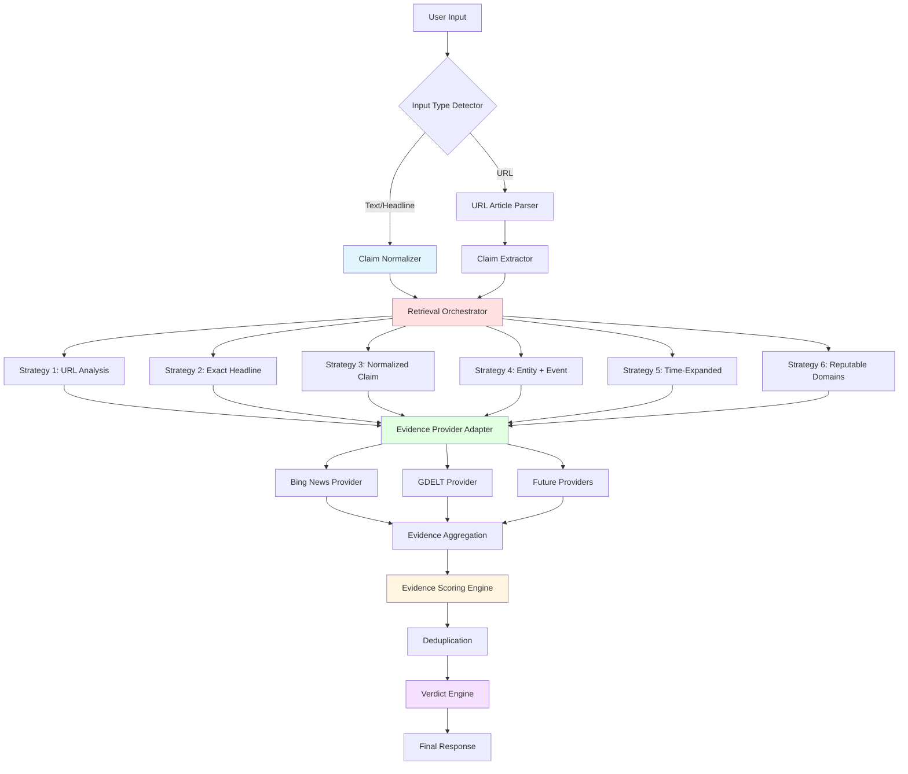
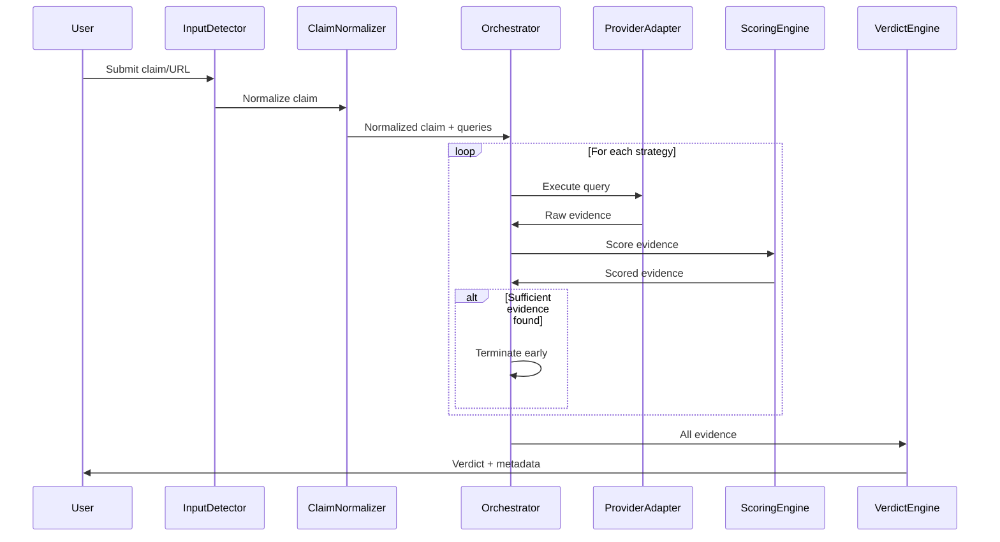

# Design Document: Production-Grade Evidence Retrieval Reliability

## Overview

This design transforms FakeNewsOff's evidence retrieval system from demo-reliable to production-reliable by introducing a comprehensive Retrieval Orchestrator architecture. The system will coordinate multiple evidence acquisition strategies, normalize claims for better search effectiveness, score and filter evidence quality, and provide transparent explanations of verdict outcomes.

### Current State

The existing system uses a basic grounding service that:
- Executes simple keyword searches via Bing News and GDELT APIs
- Performs basic deduplication by URL and title similarity
- Returns up to 6 sources with stance classification
- Lacks sophisticated query reformulation
- Has limited evidence quality assessment
- Provides minimal transparency into retrieval decisions

### Target State

The production-grade system will:
- Normalize claims to extract structured information (entities, events, temporal/location context)
- Execute multiple retrieval strategies sequentially with early termination
- Generate alternative queries when initial retrieval fails
- Score evidence across multiple dimensions (credibility, relevance, freshness, stance, entity overlap)
- Deduplicate intelligently using canonical URLs and title similarity
- Provide transparent retrieval metadata and reason codes
- Support URL analysis path for article verification
- Maintain backward compatibility with existing API contracts
- Preserve Demo Mode functionality

### Key Design Principles

1. **Preserve Existing Functionality**: All current features must continue working
2. **Backward Compatibility**: Existing API contracts must not break
3. **Graceful Degradation**: System must function even when providers fail
4. **Transparent Operation**: Users and developers must understand why verdicts were reached
5. **Configurable Behavior**: Latency budgets, quality thresholds, and strategies must be configurable
6. **Demo Mode Preservation**: Demo mode must continue to work for presentations

## Architecture

### High-Level Architecture



### Component Interaction Sequence



## Components and Interfaces

### 1. Input Type Detector

Identifies the type of user input before processing.

```typescript
export type InputType = 'raw_claim' | 'headline' | 'article_body' | 'url';

export interface InputDetectionResult {
  type: InputType;
  originalInput: string;
  confidence: number;
}

export class InputTypeDetector {
  /**
   * Detect the type of user input
   * @param input - User's input string
   * @returns Detection result with type and confidence
   */
  detect(input: string): InputDetectionResult;
}
```

**Detection Logic**:
- URL: Starts with http:// or https://, contains domain pattern
- Headline: Short (< 200 chars), title case, no paragraphs
- Article Body: Long (> 200 chars), multiple sentences/paragraphs
- Raw Claim: Default fallback

### 2. Claim Normalizer Service

Preprocesses claims to extract structured information for better retrieval.

```typescript
export interface NormalizedClaim {
  originalText: string;
  entities: string[];
  eventType?: string;
  locationContext?: string;
  timeContext?: string;
  retrievalQueries: string[];
  normalizedAt: string;
}

export class ClaimNormalizerService {
  /**
   * Normalize a claim to extract structured information
   * @param claim - Raw claim text
   * @returns Normalized claim with extracted components
   */
  async normalize(claim: string): Promise<NormalizedClaim>;
  
  /**
   * Serialize normalized claim to JSON
   * @param normalizedClaim - Normalized claim structure
   * @returns JSON string
   */
  serialize(normalizedClaim: NormalizedClaim): string;
  
  /**
   * Parse JSON into normalized claim
   * @param json - JSON string
   * @returns Normalized claim structure
   */
  parse(json: string): NormalizedClaim;
  
  /**
   * Pretty print normalized claim
   * @param normalizedClaim - Normalized claim structure
   * @returns Human-readable JSON string
   */
  prettyPrint(normalizedClaim: NormalizedClaim): string;
}
```

**Implementation Strategy**:
- Use simple regex patterns for entity extraction (proper nouns, dates, locations)
- Use keyword matching for event type identification
- Generate 2-3 retrieval queries with different formulations
- Fallback to original text if extraction fails

### 3. Retrieval Orchestrator

Central component coordinating all evidence retrieval strategies.

```typescript
export type RetrievalStrategy = 
  | 'url_analysis'
  | 'exact_headline'
  | 'normalized_claim'
  | 'entity_event'
  | 'time_expanded'
  | 'reputable_domains';

export interface RetrievalConfig {
  maxLatencyMs: number;
  minEvidenceScore: number;
  minSourceCount: number;
  enableEarlyTermination: boolean;
  strategies: RetrievalStrategy[];
}

export interface RetrievalMetadata {
  queriesAttempted: string[];
  providersUsed: string[];
  sourcesRetrieved: number;
  sourcesAfterDedup: number;
  sourcesUsedInVerdict: number;
  strategiesExecuted: RetrievalStrategy[];
  terminationReason: 'sufficient_evidence' | 'latency_budget' | 'all_strategies_complete';
  totalLatencyMs: number;
}

export interface RetrievalResult {
  evidence: ScoredEvidence[];
  metadata: RetrievalMetadata;
}

export class RetrievalOrchestrator {
  constructor(
    private config: RetrievalConfig,
    private providerAdapter: EvidenceProviderAdapter,
    private scoringEngine: EvidenceScoringEngine
  ) {}
  
  /**
   * Orchestrate evidence retrieval across multiple strategies
   * @param normalizedClaim - Normalized claim with queries
   * @param requestId - Request ID for logging
   * @returns Retrieval result with evidence and metadata
   */
  async orchestrate(
    normalizedClaim: NormalizedClaim,
    requestId?: string
  ): Promise<RetrievalResult>;
  
  /**
   * Execute a single retrieval strategy
   * @param strategy - Strategy to execute
   * @param queries - Queries for this strategy
   * @returns Raw evidence from providers
   */
  private async executeStrategy(
    strategy: RetrievalStrategy,
    queries: string[]
  ): Promise<RawEvidence[]>;
  
  /**
   * Check if sufficient evidence has been collected
   * @param evidence - Current evidence set
   * @returns True if sufficient, false otherwise
   */
  private hasSufficientEvidence(evidence: ScoredEvidence[]): boolean;
  
  /**
   * Generate alternative queries when initial retrieval fails
   * @param normalizedClaim - Normalized claim
   * @param failedQuery - Query that returned zero results
   * @returns Alternative queries
   */
  private generateAlternativeQueries(
    normalizedClaim: NormalizedClaim,
    failedQuery: string
  ): string[];
}
```

**Strategy Execution Order**:
1. URL Analysis (if URL provided)
2. Exact Headline Search
3. Normalized Claim Search
4. Entity + Event Search
5. Time-Expanded Search
6. Reputable Domain Search

**Early Termination Conditions**:
- Sufficient evidence found (>= minSourceCount with avgScore >= minEvidenceScore)
- Latency budget exceeded
- All strategies exhausted

### 4. Evidence Provider Adapter Layer

Abstraction layer making external providers interchangeable.

```typescript
export interface EvidenceProvider {
  name: string;
  
  /**
   * Search for evidence using this provider
   * @param query - Search query
   * @param options - Provider-specific options
   * @returns Raw evidence results
   */
  search(query: string, options?: Record<string, any>): Promise<RawEvidence[]>;
  
  /**
   * Check provider health
   * @returns Health status
   */
  healthCheck(): Promise<{ healthy: boolean; latencyMs?: number; error?: string }>;
}

export interface RawEvidence {
  url: string;
  title: string;
  snippet: string;
  publishDate: string;
  domain: string;
  provider: string;
}

export class EvidenceProviderAdapter {
  private providers: Map<string, EvidenceProvider>;
  
  constructor(providers: EvidenceProvider[]) {
    this.providers = new Map(providers.map(p => [p.name, p]));
  }
  
  /**
   * Search across all registered providers with fallback
   * @param query - Search query
   * @param requestId - Request ID for logging
   * @returns Aggregated raw evidence
   */
  async search(query: string, requestId?: string): Promise<RawEvidence[]>;
  
  /**
   * Register a new provider
   * @param provider - Provider implementation
   */
  registerProvider(provider: EvidenceProvider): void;
  
  /**
   * Get health status of all providers
   * @returns Health status map
   */
  async getHealthStatus(): Promise<Map<string, { healthy: boolean; latencyMs?: number }>>;
}

export class BingNewsProvider implements EvidenceProvider {
  name = 'bing';
  
  async search(query: string): Promise<RawEvidence[]> {
    // Delegate to existing BingNewsClient
  }
  
  async healthCheck(): Promise<{ healthy: boolean; latencyMs?: number }> {
    // Implement health check
  }
}

export class GDELTProvider implements EvidenceProvider {
  name = 'gdelt';
  
  async search(query: string): Promise<RawEvidence[]> {
    // Delegate to existing GDELTClient
  }
  
  async healthCheck(): Promise<{ healthy: boolean; latencyMs?: number }> {
    // Implement health check
  }
}
```

**Provider Fallback Logic**:
- Try providers in configured order
- If provider fails, log error and continue to next
- If provider times out, log timeout and continue
- Return aggregated results from all successful providers

### 5. Evidence Aggregation Layer

Merges and deduplicates evidence from multiple sources.

```typescript
export interface DeduplicationConfig {
  urlNormalization: boolean;
  titleSimilarityThreshold: number;
  domainDeduplication: boolean;
}

export class EvidenceAggregator {
  constructor(private config: DeduplicationConfig) {}
  
  /**
   * Aggregate evidence from multiple retrieval attempts
   * @param evidenceSets - Multiple sets of raw evidence
   * @returns Deduplicated evidence
   */
  aggregate(evidenceSets: RawEvidence[][]): RawEvidence[];
  
  /**
   * Deduplicate evidence by canonical URL
   * @param evidence - Raw evidence
   * @returns Deduplicated evidence
   */
  private deduplicateByUrl(evidence: RawEvidence[]): RawEvidence[];
  
  /**
   * Deduplicate evidence by title similarity
   * @param evidence - Raw evidence
   * @param threshold - Similarity threshold (0-1)
   * @returns Deduplicated evidence
   */
  private deduplicateByTitle(evidence: RawEvidence[], threshold: number): RawEvidence[];
  
  /**
   * Canonicalize URL (remove tracking params, normalize protocol)
   * @param url - Raw URL
   * @returns Canonical URL
   */
  private canonicalizeUrl(url: string): string;
  
  /**
   * Calculate title similarity using Levenshtein distance
   * @param title1 - First title
   * @param title2 - Second title
   * @returns Similarity score (0-1)
   */
  private calculateTitleSimilarity(title1: string, title2: string): number;
}
```

**Deduplication Signals**:
- Canonical URL (after removing tracking params)
- Title similarity > 85%
- Same domain + exact title match

**Selection Logic for Duplicates**:
- Retain evidence with highest credibility score
- If scores equal, retain most recent
- If dates equal, retain first encountered


### 6. Evidence Scoring Engine

Scores evidence across multiple dimensions to assess quality.

```typescript
export interface EvidenceScore {
  credibilityScore: number; // 0-1
  relevanceScore: number; // 0-1
  freshnessScore: number; // 0-1
  stanceScore: number; // -1 to 1 (negative=contradicts, positive=supports)
  entityOverlapScore: number; // 0-1
  compositeScore: number; // Weighted average
}

export interface ScoredEvidence extends RawEvidence {
  score: EvidenceScore;
}

export class EvidenceScoringEngine {
  /**
   * Score evidence across multiple dimensions
   * @param evidence - Raw evidence to score
   * @param normalizedClaim - Normalized claim for context
   * @returns Scored evidence
   */
  async score(
    evidence: RawEvidence[],
    normalizedClaim: NormalizedClaim
  ): Promise<ScoredEvidence[]>;
  
  /**
   * Calculate credibility score based on domain reputation
   * @param domain - Source domain
   * @returns Credibility score (0-1)
   */
  private calculateCredibilityScore(domain: string): number;
  
  /**
   * Calculate relevance score based on keyword overlap
   * @param evidence - Evidence to score
   * @param claim - Claim text
   * @returns Relevance score (0-1)
   */
  private calculateRelevanceScore(evidence: RawEvidence, claim: string): number;
  
  /**
   * Calculate freshness score based on publish date
   * @param publishDate - ISO8601 date string
   * @returns Freshness score (0-1)
   */
  private calculateFreshnessScore(publishDate: string): number;
  
  /**
   * Calculate stance score (supports/contradicts/neutral)
   * @param evidence - Evidence to analyze
   * @param claim - Claim text
   * @returns Stance score (-1 to 1)
   */
  private calculateStanceScore(evidence: RawEvidence, claim: string): number;
  
  /**
   * Calculate entity overlap score
   * @param evidence - Evidence to analyze
   * @param entities - Extracted entities from claim
   * @returns Entity overlap score (0-1)
   */
  private calculateEntityOverlapScore(evidence: RawEvidence, entities: string[]): number;
  
  /**
   * Calculate composite score from individual dimensions
   * @param scores - Individual dimension scores
   * @returns Composite score (0-1)
   */
  private calculateCompositeScore(scores: Omit<EvidenceScore, 'compositeScore'>): number;
}
```

**Scoring Weights**:
- Credibility: 30%
- Relevance: 30%
- Freshness: 15%
- Entity Overlap: 15%
- Stance: 10% (absolute value)

**Credibility Tiers**:
- Tier 1 (1.0): Major news agencies (Reuters, AP, BBC, etc.)
- Tier 2 (0.7): Regional news, fact-checkers
- Tier 3 (0.4): Unknown domains


### 7. Verdict Engine Update

Extends existing verdict engine to use structured evidence scoring.

```typescript
export type VerdictClassification = 'Supported' | 'Disputed' | 'Unverified' | 'Manipulated';

export type ReasonCode =
  | 'NO_EVIDENCE_FOUND'
  | 'SINGLE_SOURCE_ONLY'
  | 'PROVIDER_TIMEOUT'
  | 'LOW_RELEVANCE_EVIDENCE'
  | 'CONFLICTING_REPORTS'
  | 'STRONG_CORROBORATION'
  | 'MULTIPLE_CREDIBLE_SOURCES'
  | 'INSUFFICIENT_QUALITY';

export interface VerdictResult {
  classification: VerdictClassification;
  confidence: number; // 0-100
  reasonCodes: ReasonCode[];
  confidenceExplanation: string;
  evidenceUsed: ScoredEvidence[];
  evidenceRejected: Array<{ evidence: ScoredEvidence; reason: string }>;
}

export class VerdictEngine {
  /**
   * Determine verdict based on scored evidence
   * @param evidence - Scored evidence
   * @param normalizedClaim - Normalized claim
   * @returns Verdict result
   */
  async determineVerdict(
    evidence: ScoredEvidence[],
    normalizedClaim: NormalizedClaim
  ): Promise<VerdictResult>;
  
  /**
   * Calculate confidence score based on evidence quality and quantity
   * @param evidence - Scored evidence
   * @returns Confidence score (0-100)
   */
  private calculateConfidence(evidence: ScoredEvidence[]): number;
  
  /**
   * Generate reason codes based on evidence characteristics
   * @param evidence - Scored evidence
   * @param classification - Verdict classification
   * @returns Reason codes
   */
  private generateReasonCodes(
    evidence: ScoredEvidence[],
    classification: VerdictClassification
  ): ReasonCode[];
  
  /**
   * Generate human-readable confidence explanation
   * @param evidence - Scored evidence
   * @param reasonCodes - Reason codes
   * @returns Explanation text
   */
  private generateConfidenceExplanation(
    evidence: ScoredEvidence[],
    reasonCodes: ReasonCode[]
  ): string;
}
```

**Classification Logic**:
- **Supported**: Multiple sources (>= 3) with high composite scores (>= 0.7), consistent stance
- **Disputed**: Multiple sources with conflicting stance scores
- **Unverified**: Insufficient evidence (< 3 sources) or low quality scores (< 0.5)
- **Manipulated**: Evidence of content manipulation detected

**Reason Code Rules**:
- NO_EVIDENCE_FOUND: Zero sources retrieved
- SINGLE_SOURCE_ONLY: Exactly one source found
- PROVIDER_TIMEOUT: At least one provider timed out
- LOW_RELEVANCE_EVIDENCE: All sources have relevance < 0.3
- CONFLICTING_REPORTS: Stance scores vary by > 1.0
- STRONG_CORROBORATION: >= 3 sources with composite > 0.8
- MULTIPLE_CREDIBLE_SOURCES: >= 3 sources with credibility > 0.7
- INSUFFICIENT_QUALITY: Sources exist but composite scores < 0.5


### 8. URL Analysis Pipeline

Dedicated path for URL-based verification.

```typescript
export interface ArticleContent {
  url: string;
  title: string;
  body: string;
  publishDate?: string;
  author?: string;
  extractedClaims: string[];
}

export interface UrlAnalysisResult {
  articleContent: ArticleContent;
  corroboratingEvidence: ScoredEvidence[];
  verdict: VerdictResult;
  metadata: RetrievalMetadata;
}

export class UrlAnalysisPipeline {
  constructor(
    private claimExtractor: ClaimExtractor,
    private orchestrator: RetrievalOrchestrator,
    private verdictEngine: VerdictEngine
  ) {}
  
  /**
   * Analyze a URL and search for corroborating evidence
   * @param url - Article URL to analyze
   * @param requestId - Request ID for logging
   * @returns URL analysis result
   */
  async analyze(url: string, requestId?: string): Promise<UrlAnalysisResult>;
  
  /**
   * Fetch and parse article content from URL
   * @param url - Article URL
   * @returns Parsed article content
   */
  private async fetchArticle(url: string): Promise<ArticleContent>;
  
  /**
   * Extract verifiable claims from article
   * @param content - Article content
   * @returns Extracted claims
   */
  private async extractClaims(content: ArticleContent): Promise<string[]>;
  
  /**
   * Search for corroborating sources
   * @param claims - Extracted claims
   * @returns Corroborating evidence
   */
  private async searchCorroboration(claims: string[]): Promise<ScoredEvidence[]>;
}

export class ClaimExtractor {
  /**
   * Extract verifiable claims from article text
   * @param articleBody - Article body text
   * @returns List of extracted claims
   */
  async extract(articleBody: string): Promise<string[]>;
}
```

**URL Analysis Flow**:
1. Fetch article content (reuse existing fetchService)
2. Extract 1-3 key claims from article
3. For each claim, run retrieval orchestration
4. Aggregate evidence across all claims
5. Determine verdict based on corroboration

**Single Source Detection**:
- If only the original URL is found, add SINGLE_SOURCE_ONLY reason code
- Verdict should be Unverified with low confidence


### 9. Observability and Logging

Structured logging for the entire retrieval pipeline.

```typescript
export interface PipelineLog {
  timestamp: string;
  requestId: string;
  component: string;
  event: string;
  data: Record<string, any>;
}

export class ObservabilityService {
  /**
   * Log a pipeline event
   * @param event - Event name
   * @param component - Component name
   * @param data - Event data
   * @param requestId - Request ID
   */
  logEvent(
    event: string,
    component: string,
    data: Record<string, any>,
    requestId?: string
  ): void;
  
  /**
   * Log retrieval strategy execution
   * @param strategy - Strategy name
   * @param queries - Queries executed
   * @param results - Results count
   * @param latencyMs - Execution latency
   * @param requestId - Request ID
   */
  logStrategyExecution(
    strategy: RetrievalStrategy,
    queries: string[],
    results: number,
    latencyMs: number,
    requestId?: string
  ): void;
  
  /**
   * Log provider invocation
   * @param provider - Provider name
   * @param query - Query executed
   * @param success - Whether invocation succeeded
   * @param latencyMs - Invocation latency
   * @param requestId - Request ID
   */
  logProviderInvocation(
    provider: string,
    query: string,
    success: boolean,
    latencyMs: number,
    requestId?: string
  ): void;
  
  /**
   * Log deduplication results
   * @param beforeCount - Count before deduplication
   * @param afterCount - Count after deduplication
   * @param requestId - Request ID
   */
  logDeduplication(
    beforeCount: number,
    afterCount: number,
    requestId?: string
  ): void;
  
  /**
   * Log verdict determination
   * @param classification - Verdict classification
   * @param confidence - Confidence score
   * @param reasonCodes - Reason codes
   * @param evidenceCount - Evidence count
   * @param requestId - Request ID
   */
  logVerdictDetermination(
    classification: VerdictClassification,
    confidence: number,
    reasonCodes: ReasonCode[],
    evidenceCount: number,
    requestId?: string
  ): void;
}
```

**Log Fields**:
- timestamp: ISO8601 timestamp
- request_id: Unique request identifier
- component: Component name (orchestrator, provider, scorer, etc.)
- event: Event name (strategy_start, provider_success, dedup_complete, etc.)
- data: Event-specific data

**Health Endpoints**:
- `/health/providers`: Provider health status
- `/health/orchestrator`: Orchestrator configuration and status


### 10. API Response Extension

Extended response schema maintaining backward compatibility.

```typescript
export interface ExtendedAnalysisResponse {
  // Existing fields (preserved for backward compatibility)
  status: VerdictClassification;
  confidence: number;
  sources: EvidenceSource[];
  sift: SIFTDetails;
  recommendation: string;
  
  // New fields (optional to maintain compatibility)
  normalizedClaim?: NormalizedClaim;
  retrievalMetadata?: RetrievalMetadata;
  evidenceSummary?: {
    totalRetrieved: number;
    totalUsed: number;
    averageQuality: number;
    sourceDistribution: Record<string, number>;
  };
  reasonCodes?: ReasonCode[];
  confidenceExplanation?: string;
}
```

**Backward Compatibility Strategy**:
- All new fields are optional
- Existing fields maintain same types and semantics
- Frontend can gracefully handle missing new fields
- Demo mode returns both old and new fields

## Data Models

### Core Data Structures

```typescript
// Configuration
export interface ProductionRetrievalConfig {
  // Orchestration
  maxLatencyMs: number;
  minEvidenceScore: number;
  minSourceCount: number;
  enableEarlyTermination: boolean;
  
  // Strategies
  enabledStrategies: RetrievalStrategy[];
  strategyTimeoutMs: number;
  
  // Query reformulation
  maxAlternativeQueries: number;
  enableQueryReformulation: boolean;
  
  // Deduplication
  titleSimilarityThreshold: number;
  enableUrlNormalization: boolean;
  
  // Scoring
  scoringWeights: {
    credibility: number;
    relevance: number;
    freshness: number;
    entityOverlap: number;
    stance: number;
  };
  
  // Providers
  providerOrder: string[];
  providerTimeoutMs: number;
}

// Default configuration
export const DEFAULT_CONFIG: ProductionRetrievalConfig = {
  maxLatencyMs: 10000,
  minEvidenceScore: 0.5,
  minSourceCount: 3,
  enableEarlyTermination: true,
  enabledStrategies: [
    'url_analysis',
    'exact_headline',
    'normalized_claim',
    'entity_event',
    'time_expanded',
    'reputable_domains'
  ],
  strategyTimeoutMs: 2000,
  maxAlternativeQueries: 2,
  enableQueryReformulation: true,
  titleSimilarityThreshold: 0.85,
  enableUrlNormalization: true,
  scoringWeights: {
    credibility: 0.30,
    relevance: 0.30,
    freshness: 0.15,
    entityOverlap: 0.15,
    stance: 0.10
  },
  providerOrder: ['bing', 'gdelt'],
  providerTimeoutMs: 3500
};
```


## Correctness Properties

*A property is a characteristic or behavior that should hold true across all valid executions of a system—essentially, a formal statement about what the system should do. Properties serve as the bridge between human-readable specifications and machine-verifiable correctness guarantees.*

### Property Reflection

After analyzing all acceptance criteria, the following consolidations were identified:

- **Input type processing (1.1-1.4)**: Consolidated into a single property about input type handling
- **Claim normalization (2.1-2.6)**: Consolidated into properties about extraction completeness and structure
- **Strategy execution order (3.1-3.7)**: Consolidated into a single property about sequential execution
- **Evidence scoring (6.1-6.6)**: Consolidated into a property about score bounds and structure
- **Retrieval metadata (10.1-10.5)**: Consolidated into a property about metadata completeness
- **Provider fallback (11.1-11.4)**: Consolidated into a property about graceful degradation
- **Response structure (12.1-12.5)**: Consolidated into properties about completeness and compatibility
- **Logging (15.1-15.5)**: Consolidated into a property about structured logging
- **Serialization (18.1-18.5)**: Consolidated into properties about round-trip and error handling

### Property 1: Input Type Processing

*For any* input string (raw claim, headline, article body, or URL), the Evidence_Retrieval_System should process it as a verification request without error.

**Validates: Requirements 1.1, 1.2, 1.3, 1.4**

### Property 2: Input Type Detection

*For any* input string, the InputTypeDetector should classify it as one of the valid input types (raw_claim, headline, article_body, url) before processing begins.

**Validates: Requirements 1.5**

### Property 3: Entity Extraction Completeness

*For any* claim containing identifiable named entities, the Claim_Normalizer should extract those entities and include them in the NormalizedClaim structure.

**Validates: Requirements 2.1**

### Property 4: Event Identification

*For any* claim containing an identifiable event or action, the Claim_Normalizer should identify the primary event and include it in the NormalizedClaim structure.

**Validates: Requirements 2.2**

### Property 5: Temporal Context Extraction

*For any* claim containing temporal references, the Claim_Normalizer should extract the temporal context and include it in the NormalizedClaim structure.

**Validates: Requirements 2.3**

### Property 6: Location Context Extraction

*For any* claim containing location references, the Claim_Normalizer should extract the location context and include it in the NormalizedClaim structure.

**Validates: Requirements 2.4**

### Property 7: Query Generation Minimum

*For any* claim, when normalization completes, the Claim_Normalizer should generate at least one normalized search query.

**Validates: Requirements 2.5**

### Property 8: Normalized Claim Structure Completeness

*For any* claim, the Claim_Normalizer should produce a NormalizedClaim structure containing all required fields (originalText, entities, retrievalQueries, normalizedAt).

**Validates: Requirements 2.6**

### Property 9: Strategy Execution Order

*For any* retrieval orchestration, strategies should be executed in the specified order: URL analysis (if URL provided), exact headline, normalized claim, entity+event, time-expanded, reputable domains.

**Validates: Requirements 3.1, 3.2, 3.3, 3.4, 3.5, 3.6, 3.7**

### Property 10: Early Termination on Sufficient Evidence

*For any* retrieval orchestration, when sufficient evidence is found (meeting quality and quantity thresholds), further strategy attempts should be terminated.

**Validates: Requirements 3.8**

### Property 11: Query Reformulation on Failure

*For any* retrieval strategy that returns zero results, the Evidence_Retrieval_System should generate at least two alternative queries and attempt retrieval with each.

**Validates: Requirements 4.1, 4.2, 4.3**

### Property 12: URL Deduplication

*For any* set of evidence sources with duplicate canonical URLs, only one source should be retained (the one with highest credibility score).

**Validates: Requirements 5.1, 5.4**

### Property 13: Title Similarity Deduplication

*For any* set of evidence sources with title similarity exceeding 85%, only one source should be retained (the one with highest credibility score).

**Validates: Requirements 5.2, 5.4**

### Property 14: Domain Deduplication for Exact Titles

*For any* set of evidence sources from the same domain with exactly matching titles, only one source should be retained (the one with highest credibility score).

**Validates: Requirements 5.3, 5.4**

### Property 15: Evidence Score Bounds

*For any* retrieved evidence source, all assigned scores (credibility, relevance, freshness, entityOverlap) should be in the range [0, 1], and stance score should be in the range [-1, 1].

**Validates: Requirements 6.1, 6.2, 6.3, 6.4, 6.5**

### Property 16: Evidence Score Structure Completeness

*For any* retrieved evidence source, the Evidence_Retrieval_System should produce an EvidenceScore structure containing all required dimensions (credibility, relevance, freshness, stance, entityOverlap, composite).

**Validates: Requirements 6.6**

### Property 17: URL Analysis Pipeline Execution

*For any* URL input, the Evidence_Retrieval_System should parse the article content, extract claims, search for corroboration, and return both article analysis and corroboration results.

**Validates: Requirements 7.1, 7.2, 7.3, 7.4, 7.5**

### Property 18: Verdict Classification Validity

*For any* completed evidence collection, the Verdict_Engine should classify the result as one of the valid classifications (Supported, Disputed, Unverified, Manipulated).

**Validates: Requirements 8.1**

### Property 19: Verdict Classification Logic

*For any* evidence set with strong corroboration (multiple high-scoring sources with consistent stance), the Verdict_Engine should classify as Supported; for conflicting evidence, classify as Disputed; for insufficient evidence, classify as Unverified; for manipulation indicators, classify as Manipulated.

**Validates: Requirements 8.2, 8.3, 8.4, 8.5**

### Property 20: Score-Based Classification

*For any* verdict determination, the classification should be based on Evidence_Score thresholds and not solely on retrieval success (low-quality evidence should not automatically result in Supported).

**Validates: Requirements 8.6**

### Property 21: Reason Code Presence

*For any* determined verdict, the Verdict_Engine should include at least one Reason_Code in the response.

**Validates: Requirements 9.1**

### Property 22: Specific Reason Codes

*For any* verdict with zero evidence, the Verdict_Engine should include NO_EVIDENCE_FOUND; for single source, include SINGLE_SOURCE_ONLY; for provider timeout, include PROVIDER_TIMEOUT; for low relevance (< 0.3), include LOW_RELEVANCE_EVIDENCE; for conflicting stance, include CONFLICTING_REPORTS.

**Validates: Requirements 9.2, 9.3, 9.4, 9.5, 9.6**

### Property 23: Multiple Reason Codes

*For any* verdict where multiple conditions apply (e.g., low relevance AND provider timeout), all applicable Reason_Code values should be included in the response.

**Validates: Requirements 9.7**

### Property 24: Retrieval Metadata Completeness

*For any* completed evidence retrieval, the Evidence_Retrieval_System should include RetrievalMetadata containing all queries attempted, providers used, source counts (retrieved, after dedup, used in verdict), strategies executed, and termination reason.

**Validates: Requirements 10.1, 10.2, 10.3, 10.4, 10.5**

### Property 25: Provider Error Logging

*For any* retrieval provider that returns an error or times out, the Evidence_Retrieval_System should log the error and continue with remaining providers.

**Validates: Requirements 11.1, 11.2, 11.3**

### Property 26: Graceful Degradation

*For any* retrieval orchestration where one or more providers fail, the Evidence_Retrieval_System should complete analysis using evidence from successful providers.

**Validates: Requirements 11.4**

### Property 27: Extended Response Structure

*For any* completed analysis, the Evidence_Retrieval_System should include normalizedClaim, retrievalMetadata, evidenceSummary, and reasonCodes in the response.

**Validates: Requirements 12.1, 12.2, 12.3, 12.4**

### Property 28: Backward Compatibility

*For any* analysis response, all existing response fields (status, confidence, sources, sift, recommendation) should be present and maintain their original types and semantics.

**Validates: Requirements 12.5**

### Property 29: Demo Mode Isolation

*For any* request with Demo_Mode enabled, the Evidence_Retrieval_System should use synthetic data sources and not invoke external Retrieval_Provider instances.

**Validates: Requirements 13.1, 13.2**

### Property 30: Production Mode Real-Time Queries

*For any* request with Production_Mode enabled, the Evidence_Retrieval_System should use real-time API queries to external providers.

**Validates: Requirements 13.3**

### Property 31: Mode Switching Without Code Changes

*For any* system configuration, switching between Demo_Mode and Production_Mode should be achievable through configuration changes without code modifications.

**Validates: Requirements 13.4**

### Property 32: Latency Budget Compliance

*For any* retrieval orchestration with a configured latency budget, evidence retrieval should complete within the budget or terminate with partial results.

**Validates: Requirements 14.1, 14.2, 14.3**

### Property 33: Default Latency Budget

*For any* retrieval orchestration without an explicitly configured latency budget, the system should default to 10 seconds.

**Validates: Requirements 14.4**

### Property 34: Structured Logging Completeness

*For any* pipeline execution, structured log entries should be emitted for strategy attempts, provider invocations, deduplication, and verdict determination, each containing timestamp, request ID, and component name.

**Validates: Requirements 15.1, 15.2, 15.3, 15.4, 15.5**

### Property 35: Provider Interface Definition

*For any* evidence provider implementation, it should conform to the EvidenceProvider interface with search() and healthCheck() methods.

**Validates: Requirements 16.1**

### Property 36: Provider Extensibility

*For any* new evidence source, a new Retrieval_Provider implementation should be addable without modifying existing provider implementations.

**Validates: Requirements 16.2**

### Property 37: Provider Registry Loading

*For any* configured set of providers, the Evidence_Retrieval_System should load all providers through the registry and invoke them during retrieval.

**Validates: Requirements 16.3, 16.4**

### Property 38: Normalized Claim Serialization Round-Trip

*For any* valid NormalizedClaim structure, serializing to JSON, then parsing, then pretty printing, then parsing again should produce an equivalent NormalizedClaim structure.

**Validates: Requirements 18.1, 18.2, 18.3, 18.4**

### Property 39: Invalid JSON Error Handling

*For any* invalid JSON representation provided to the Claim_Normalizer parser, a descriptive error should be returned.

**Validates: Requirements 18.5**


## Error Handling

### Error Categories and Recovery Strategies

#### 1. Provider Errors

**Scenarios**:
- Provider API returns error response
- Provider times out
- Provider returns malformed data
- All providers fail

**Recovery**:
```typescript
async function handleProviderError(
  provider: string,
  error: Error,
  remainingProviders: string[]
): Promise<void> {
  // Log error with context
  logger.error('Provider failed', {
    provider,
    error: error.message,
    remaining_providers: remainingProviders
  });
  
  // Continue with next provider
  if (remainingProviders.length > 0) {
    return; // Orchestrator will try next provider
  }
  
  // All providers failed - return empty results with reason code
  throw new AllProvidersFailedError('All evidence providers failed', {
    attemptedProviders: [provider, ...remainingProviders],
    errors: [error.message]
  });
}
```

#### 2. Normalization Errors

**Scenarios**:
- Claim text is empty or invalid
- Entity extraction fails
- Query generation fails

**Recovery**:
```typescript
async function handleNormalizationError(
  claim: string,
  error: Error
): Promise<NormalizedClaim> {
  logger.warn('Normalization failed, using fallback', {
    error: error.message,
    claim_length: claim.length
  });
  
  // Fallback: treat entire claim as single query
  return {
    originalText: claim,
    entities: [],
    retrievalQueries: [claim],
    normalizedAt: new Date().toISOString()
  };
}
```

#### 3. Scoring Errors

**Scenarios**:
- Score calculation fails
- Invalid score values
- Missing required data for scoring

**Recovery**:
```typescript
function handleScoringError(
  evidence: RawEvidence,
  error: Error
): EvidenceScore {
  logger.warn('Scoring failed, using default scores', {
    url: evidence.url,
    error: error.message
  });
  
  // Return conservative default scores
  return {
    credibilityScore: 0.5,
    relevanceScore: 0.5,
    freshnessScore: 0.5,
    stanceScore: 0.0,
    entityOverlapScore: 0.5,
    compositeScore: 0.5
  };
}
```

#### 4. URL Analysis Errors

**Scenarios**:
- URL fetch fails (404, timeout, etc.)
- Article parsing fails
- Claim extraction fails

**Recovery**:
```typescript
async function handleUrlAnalysisError(
  url: string,
  error: Error
): Promise<UrlAnalysisResult> {
  logger.error('URL analysis failed', {
    url,
    error: error.message
  });
  
  // Return unverified verdict with reason code
  return {
    articleContent: {
      url,
      title: 'Unable to fetch article',
      body: '',
      extractedClaims: []
    },
    corroboratingEvidence: [],
    verdict: {
      classification: 'Unverified',
      confidence: 0,
      reasonCodes: ['NO_EVIDENCE_FOUND'],
      confidenceExplanation: 'Unable to fetch or parse article content',
      evidenceUsed: [],
      evidenceRejected: []
    },
    metadata: {
      queriesAttempted: [],
      providersUsed: [],
      sourcesRetrieved: 0,
      sourcesAfterDedup: 0,
      sourcesUsedInVerdict: 0,
      strategiesExecuted: ['url_analysis'],
      terminationReason: 'all_strategies_complete',
      totalLatencyMs: 0
    }
  };
}
```

#### 5. Latency Budget Exceeded

**Scenarios**:
- Retrieval takes longer than configured budget
- Individual strategy exceeds timeout

**Recovery**:
```typescript
function handleLatencyBudgetExceeded(
  collectedEvidence: ScoredEvidence[],
  elapsedMs: number,
  budgetMs: number
): RetrievalResult {
  logger.warn('Latency budget exceeded', {
    elapsed_ms: elapsedMs,
    budget_ms: budgetMs,
    evidence_collected: collectedEvidence.length
  });
  
  // Return partial results
  return {
    evidence: collectedEvidence,
    metadata: {
      queriesAttempted: [], // populated from context
      providersUsed: [], // populated from context
      sourcesRetrieved: collectedEvidence.length,
      sourcesAfterDedup: collectedEvidence.length,
      sourcesUsedInVerdict: collectedEvidence.length,
      strategiesExecuted: [], // populated from context
      terminationReason: 'latency_budget',
      totalLatencyMs: elapsedMs
    }
  };
}
```

### Error Logging Standards

All errors should be logged with:
- Error type and message
- Component where error occurred
- Input context (claim, query, URL)
- Recovery action taken
- Impact on final result

Example log entry:
```json
{
  "timestamp": "2024-01-15T10:30:00Z",
  "level": "error",
  "component": "provider_adapter",
  "event": "provider_error",
  "request_id": "req_123",
  "provider": "bing",
  "error": "API rate limit exceeded",
  "recovery": "fallback_to_gdelt",
  "impact": "partial_results"
}
```


## Testing Strategy

### Dual Testing Approach

This feature requires both unit tests and property-based tests for comprehensive coverage:

**Unit Tests** focus on:
- Specific examples of claim normalization (e.g., "President announces policy" → entities, events)
- Edge cases (empty claims, malformed URLs, special characters)
- Error conditions (provider timeout, zero results, invalid JSON)
- Integration points (provider adapter, scoring engine, verdict engine)
- Configuration validation
- Demo mode behavior
- Backward compatibility verification

**Property-Based Tests** focus on:
- Universal properties across all inputs (see Correctness Properties section)
- Randomized claim generation with known structure
- Randomized evidence candidate generation
- Comprehensive input coverage through iteration
- Round-trip properties (serialization/deserialization)
- Score bounds validation
- Deduplication correctness

### Property-Based Testing Configuration

**Library**: Use `fast-check` for TypeScript property-based testing

**Configuration**:
- Minimum 100 iterations per property test
- Each test must reference its design document property
- Tag format: `Feature: production-grade-evidence-retrieval-reliability, Property {number}: {property_text}`

**Example Property Test Structure**:

```typescript
import fc from 'fast-check';

describe('Property 8: Normalized Claim Structure Completeness', () => {
  it('should produce complete NormalizedClaim structure for any claim', async () => {
    // Feature: production-grade-evidence-retrieval-reliability, Property 8
    await fc.assert(
      fc.asyncProperty(
        fc.string({ minLength: 10, maxLength: 500 }),
        async (claim) => {
          const normalizer = new ClaimNormalizerService();
          const normalized = await normalizer.normalize(claim);
          
          // Verify all required fields are present
          expect(normalized).toHaveProperty('originalText');
          expect(normalized).toHaveProperty('entities');
          expect(normalized).toHaveProperty('retrievalQueries');
          expect(normalized).toHaveProperty('normalizedAt');
          
          // Verify types
          expect(typeof normalized.originalText).toBe('string');
          expect(Array.isArray(normalized.entities)).toBe(true);
          expect(Array.isArray(normalized.retrievalQueries)).toBe(true);
          expect(typeof normalized.normalizedAt).toBe('string');
        }
      ),
      { numRuns: 100 }
    );
  });
});

describe('Property 15: Evidence Score Bounds', () => {
  it('should assign scores within valid bounds for any evidence', async () => {
    // Feature: production-grade-evidence-retrieval-reliability, Property 15
    await fc.assert(
      fc.asyncProperty(
        rawEvidenceArbitrary(),
        normalizedClaimArbitrary(),
        async (evidence, claim) => {
          const scorer = new EvidenceScoringEngine();
          const scored = await scorer.score([evidence], claim);
          
          for (const item of scored) {
            // Verify bounds
            expect(item.score.credibilityScore).toBeGreaterThanOrEqual(0);
            expect(item.score.credibilityScore).toBeLessThanOrEqual(1);
            
            expect(item.score.relevanceScore).toBeGreaterThanOrEqual(0);
            expect(item.score.relevanceScore).toBeLessThanOrEqual(1);
            
            expect(item.score.freshnessScore).toBeGreaterThanOrEqual(0);
            expect(item.score.freshnessScore).toBeLessThanOrEqual(1);
            
            expect(item.score.stanceScore).toBeGreaterThanOrEqual(-1);
            expect(item.score.stanceScore).toBeLessThanOrEqual(1);
            
            expect(item.score.entityOverlapScore).toBeGreaterThanOrEqual(0);
            expect(item.score.entityOverlapScore).toBeLessThanOrEqual(1);
          }
        }
      ),
      { numRuns: 100 }
    );
  });
});

describe('Property 38: Normalized Claim Serialization Round-Trip', () => {
  it('should preserve structure through serialize-parse-prettyPrint-parse cycle', async () => {
    // Feature: production-grade-evidence-retrieval-reliability, Property 38
    await fc.assert(
      fc.asyncProperty(
        normalizedClaimArbitrary(),
        async (original) => {
          const normalizer = new ClaimNormalizerService();
          
          // Round trip: serialize → parse → prettyPrint → parse
          const json1 = normalizer.serialize(original);
          const parsed1 = normalizer.parse(json1);
          const pretty = normalizer.prettyPrint(parsed1);
          const parsed2 = normalizer.parse(pretty);
          
          // Verify equivalence
          expect(parsed2).toEqual(original);
        }
      ),
      { numRuns: 100 }
    );
  });
});
```

### Test Data Generators (Arbitraries)

```typescript
// Generate random raw evidence
function rawEvidenceArbitrary(): fc.Arbitrary<RawEvidence> {
  return fc.record({
    url: fc.webUrl(),
    title: fc.string({ minLength: 10, maxLength: 200 }),
    snippet: fc.string({ minLength: 50, maxLength: 500 }),
    publishDate: fc.date().map(d => d.toISOString()),
    domain: fc.domain(),
    provider: fc.constantFrom('bing', 'gdelt')
  });
}

// Generate random normalized claim
function normalizedClaimArbitrary(): fc.Arbitrary<NormalizedClaim> {
  return fc.record({
    originalText: fc.string({ minLength: 10, maxLength: 500 }),
    entities: fc.array(fc.string({ minLength: 3, maxLength: 50 }), { maxLength: 10 }),
    eventType: fc.option(fc.string({ minLength: 5, maxLength: 50 })),
    locationContext: fc.option(fc.string({ minLength: 3, maxLength: 50 })),
    timeContext: fc.option(fc.string({ minLength: 5, maxLength: 50 })),
    retrievalQueries: fc.array(fc.string({ minLength: 10, maxLength: 200 }), { minLength: 1, maxLength: 5 }),
    normalizedAt: fc.date().map(d => d.toISOString())
  });
}

// Generate random scored evidence
function scoredEvidenceArbitrary(): fc.Arbitrary<ScoredEvidence> {
  return fc.record({
    url: fc.webUrl(),
    title: fc.string({ minLength: 10, maxLength: 200 }),
    snippet: fc.string({ minLength: 50, maxLength: 500 }),
    publishDate: fc.date().map(d => d.toISOString()),
    domain: fc.domain(),
    provider: fc.constantFrom('bing', 'gdelt'),
    score: fc.record({
      credibilityScore: fc.double({ min: 0, max: 1 }),
      relevanceScore: fc.double({ min: 0, max: 1 }),
      freshnessScore: fc.double({ min: 0, max: 1 }),
      stanceScore: fc.double({ min: -1, max: 1 }),
      entityOverlapScore: fc.double({ min: 0, max: 1 }),
      compositeScore: fc.double({ min: 0, max: 1 })
    })
  });
}
```

### Integration Testing

Test the complete pipeline with:
- Real provider clients (in integration test environment with test API keys)
- End-to-end claim → verdict flow
- URL analysis pipeline
- Demo mode vs production mode switching
- Latency budget enforcement
- Provider fallback behavior
- Error recovery scenarios

### Unit Testing Focus Areas

1. **Input Type Detection**:
   - Test URL detection (various URL formats)
   - Test headline detection (short, title case)
   - Test article body detection (long, paragraphs)
   - Test edge cases (empty, special characters)

2. **Claim Normalization**:
   - Test entity extraction (proper nouns, dates, locations)
   - Test event identification (actions, verbs)
   - Test query generation (multiple formulations)
   - Test fallback behavior (extraction failures)

3. **Retrieval Orchestration**:
   - Test strategy execution order
   - Test early termination logic
   - Test latency budget enforcement
   - Test query reformulation on failure

4. **Evidence Scoring**:
   - Test credibility scoring (known domains)
   - Test relevance scoring (keyword overlap)
   - Test freshness scoring (date calculations)
   - Test stance scoring (support/contradict detection)
   - Test composite score calculation

5. **Deduplication**:
   - Test URL canonicalization
   - Test title similarity calculation
   - Test duplicate selection (highest credibility)

6. **Verdict Engine**:
   - Test classification logic (supported, disputed, unverified, manipulated)
   - Test reason code generation
   - Test confidence calculation
   - Test explanation generation

7. **Backward Compatibility**:
   - Test existing response fields are preserved
   - Test new fields are optional
   - Test demo mode returns expected format

### Mocking Strategy

For unit tests, mock:
- Provider clients (use fixtures for common patterns)
- External HTTP requests (for URL fetching)
- Date/time for deterministic freshness scores

For property tests, use:
- Real implementations where possible
- Mocks only for external dependencies (providers, HTTP)
- Deterministic mocks that respect property invariants

### Performance Testing

Benchmark:
- End-to-end latency (claim → verdict)
- Individual component latency (normalization, scoring, deduplication)
- Provider call latency
- Memory usage for large evidence sets
- Latency budget compliance

Target metrics:
- P50 latency: < 5 seconds
- P95 latency: < 10 seconds
- P99 latency: < 15 seconds
- Memory: < 100MB per request


## Integration Points with Existing Backend

### 1. Grounding Service Integration

**Current**: `GroundingService` provides basic news search via Bing/GDELT

**Integration Strategy**:
- Wrap existing `GroundingService` in `EvidenceProviderAdapter`
- Create `BingNewsProvider` and `GDELTProvider` that delegate to existing clients
- Preserve existing caching behavior
- Maintain existing health check endpoints

```typescript
// Adapter wrapping existing service
export class GroundingServiceAdapter implements EvidenceProvider {
  name = 'grounding_service';
  
  constructor(private groundingService: GroundingService) {}
  
  async search(query: string): Promise<RawEvidence[]> {
    const bundle = await this.groundingService.ground(query);
    return bundle.sources.map(source => ({
      url: source.url,
      title: source.title,
      snippet: source.snippet,
      publishDate: source.publishDate,
      domain: source.domain,
      provider: bundle.providerUsed
    }));
  }
  
  async healthCheck(): Promise<{ healthy: boolean; latencyMs?: number }> {
    const status = this.groundingService.getHealthStatus();
    return { healthy: status.ok };
  }
}
```

### 2. Nova Client Integration

**Current**: `NovaClient` handles LLM operations for claim extraction and synthesis

**Integration Strategy**:
- Reuse existing `NovaClient` for claim extraction in URL analysis
- No changes needed to existing methods
- Add new methods if needed for advanced normalization (optional)

### 3. Fetch Service Integration

**Current**: `FetchService` fetches and parses web content

**Integration Strategy**:
- Reuse existing `fetchFullText()` for URL analysis pipeline
- Preserve existing LRU cache
- Maintain existing timeout and error handling

### 4. Cache Service Integration

**Current**: `CacheService` caches analysis results in DynamoDB

**Integration Strategy**:
- Extend cache to include new response fields (normalizedClaim, retrievalMetadata)
- Maintain backward compatibility for cache hits from old format
- Add cache versioning to handle schema evolution

```typescript
interface CachedAnalysisV2 {
  version: 2;
  // Old fields
  status: string;
  confidence: number;
  sources: any[];
  // New fields
  normalizedClaim?: NormalizedClaim;
  retrievalMetadata?: RetrievalMetadata;
  reasonCodes?: ReasonCode[];
}
```

### 5. Demo Mode Integration

**Current**: Demo mode returns deterministic synthetic data

**Integration Strategy**:
- Extend demo mode to include new response fields
- Create demo fixtures for normalized claims and retrieval metadata
- Ensure demo mode bypasses all new components (orchestrator, scorer, etc.)

```typescript
export function getDemoRetrievalMetadata(claim: string): RetrievalMetadata {
  return {
    queriesAttempted: [claim, `${claim} news`, `${claim} fact check`],
    providersUsed: ['demo'],
    sourcesRetrieved: 6,
    sourcesAfterDedup: 6,
    sourcesUsedInVerdict: 6,
    strategiesExecuted: ['exact_headline', 'normalized_claim'],
    terminationReason: 'sufficient_evidence',
    totalLatencyMs: 500
  };
}
```

## Deployment Considerations

### Phase 1: Foundation (Week 1)

**Goal**: Implement core components without breaking existing functionality

**Tasks**:
1. Create new types and interfaces
2. Implement `InputTypeDetector`
3. Implement `ClaimNormalizerService` (basic version)
4. Implement `EvidenceProviderAdapter` wrapping existing `GroundingService`
5. Add comprehensive unit tests
6. Verify all existing tests still pass

**Validation**:
- All existing tests pass
- TypeScript compilation succeeds
- No changes to API responses yet

### Phase 2: Orchestration (Week 2)

**Goal**: Implement retrieval orchestration with multiple strategies

**Tasks**:
1. Implement `RetrievalOrchestrator`
2. Implement strategy execution logic
3. Implement early termination
4. Implement query reformulation
5. Add integration tests
6. Add property-based tests for orchestration

**Validation**:
- Orchestrator executes strategies in order
- Early termination works correctly
- Latency budget is enforced
- All tests pass

### Phase 3: Scoring and Aggregation (Week 3)

**Goal**: Implement evidence scoring and deduplication

**Tasks**:
1. Implement `EvidenceScoringEngine`
2. Implement `EvidenceAggregator`
3. Implement deduplication logic
4. Add unit tests for scoring
5. Add property-based tests for score bounds
6. Add property-based tests for deduplication

**Validation**:
- Scores are within valid bounds
- Deduplication works correctly
- Composite scores are calculated properly
- All tests pass

### Phase 4: Verdict Engine Extension (Week 4)

**Goal**: Extend verdict engine with new classification logic

**Tasks**:
1. Extend `VerdictEngine` with score-based classification
2. Implement reason code generation
3. Implement confidence explanation
4. Add unit tests for verdict logic
5. Add integration tests for end-to-end flow

**Validation**:
- Verdicts use score thresholds
- Reason codes are generated correctly
- Confidence explanations are meaningful
- All tests pass

### Phase 5: API Integration (Week 5)

**Goal**: Integrate new components into API response

**Tasks**:
1. Extend API response schema
2. Update lambda handler to use new orchestrator
3. Maintain backward compatibility
4. Update demo mode
5. Add integration tests for API
6. Update documentation

**Validation**:
- API returns extended response
- Existing fields are preserved
- Demo mode works
- All tests pass
- Documentation is updated

### Phase 6: Production Validation (Week 6)

**Goal**: Validate in production-like environment

**Tasks**:
1. Deploy to staging environment
2. Run smoke tests with real API keys
3. Monitor latency and error rates
4. Validate provider fallback
5. Test with various claim types
6. Performance testing

**Validation**:
- P95 latency < 10 seconds
- Provider fallback works
- Error handling is graceful
- No regressions in existing functionality

### Rollout Strategy

**Feature Flag**: Use environment variable `ENABLE_PRODUCTION_RETRIEVAL=true/false`

**Gradual Rollout**:
1. Deploy with flag disabled (default to existing behavior)
2. Enable for internal testing
3. Enable for 10% of traffic
4. Monitor metrics (latency, error rate, verdict distribution)
5. Increase to 50% if metrics are good
6. Increase to 100% after 1 week of stable operation

**Rollback Plan**:
- If error rate > 5%, rollback to existing behavior
- If P95 latency > 15 seconds, rollback
- If verdict quality degrades, rollback

### Monitoring and Observability

**Key Metrics**:
- Request latency (P50, P95, P99)
- Provider success rate
- Strategy execution counts
- Evidence quality scores (average)
- Verdict distribution
- Reason code distribution
- Cache hit rate
- Error rate by component

**Alerts**:
- Error rate > 5% for 5 minutes
- P95 latency > 15 seconds for 5 minutes
- Provider failure rate > 50% for 5 minutes
- Zero evidence rate > 30% for 10 minutes

**Dashboards**:
- Real-time request metrics
- Provider health status
- Evidence quality distribution
- Verdict classification distribution
- Error breakdown by component

## Security Considerations

### Input Validation

- Validate claim length (max 5000 characters)
- Sanitize URLs before fetching
- Validate provider responses
- Prevent injection attacks in queries

### Rate Limiting

- Limit requests per user/IP
- Limit provider API calls per minute
- Implement exponential backoff for retries

### Data Privacy

- Redact PII from logs
- Don't cache sensitive claims
- Sanitize error messages

### API Security

- Maintain existing authentication
- Add request signing for provider calls
- Validate response signatures

## Future Enhancements

### Phase 2 Improvements

1. **Advanced Claim Normalization**:
   - Use LLM for entity extraction
   - Implement coreference resolution
   - Add semantic similarity for query generation

2. **Additional Providers**:
   - Add fact-checking APIs (Snopes, PolitiFact)
   - Add social media APIs (Twitter, Reddit)
   - Add academic databases (Google Scholar)

3. **Enhanced Scoring**:
   - Add source reputation database
   - Implement temporal decay for freshness
   - Add geographic relevance scoring

4. **Machine Learning**:
   - Train relevance scoring model
   - Train stance detection model
   - Train verdict classification model

5. **Real-Time Updates**:
   - Implement webhook subscriptions for new evidence
   - Add real-time evidence streaming
   - Implement incremental verdict updates

## Conclusion

This design provides a comprehensive architecture for production-grade evidence retrieval reliability in FakeNewsOff. The system introduces:

1. **Structured Claim Normalization**: Extracts entities, events, and context for better retrieval
2. **Multi-Strategy Orchestration**: Executes multiple retrieval strategies with early termination
3. **Evidence Quality Scoring**: Assesses evidence across multiple dimensions
4. **Intelligent Deduplication**: Removes duplicates using URL and title similarity
5. **Transparent Verdict Logic**: Provides reason codes and confidence explanations
6. **Graceful Degradation**: Continues functioning when providers fail
7. **Backward Compatibility**: Preserves existing API contracts
8. **Demo Mode Preservation**: Maintains demonstration capabilities

The design prioritizes:
- **Reliability**: Graceful error handling and provider fallback
- **Transparency**: Detailed metadata and reason codes
- **Performance**: Latency budgets and early termination
- **Extensibility**: Provider adapter pattern for new sources
- **Testability**: Comprehensive unit and property-based tests
- **Maintainability**: Clear component boundaries and interfaces

The phased deployment approach ensures safe rollout with minimal risk to existing functionality. The feature flag strategy allows gradual enablement and easy rollback if issues arise.

This design transforms FakeNewsOff from a demo-reliable system into a production-ready misinformation verification platform capable of handling real-world complexity and scale.

