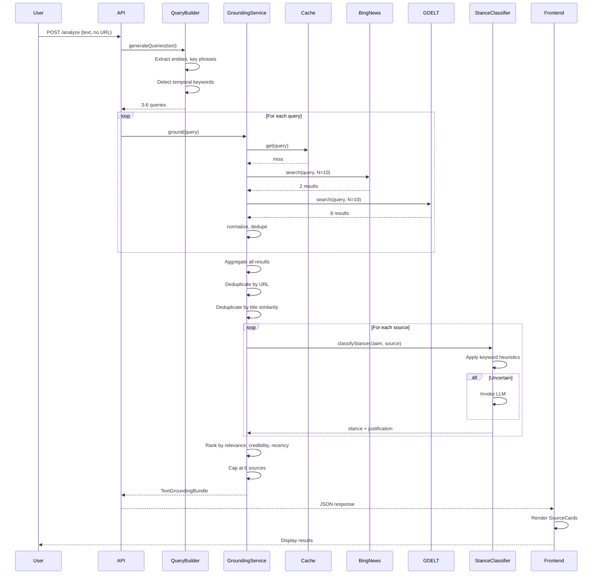
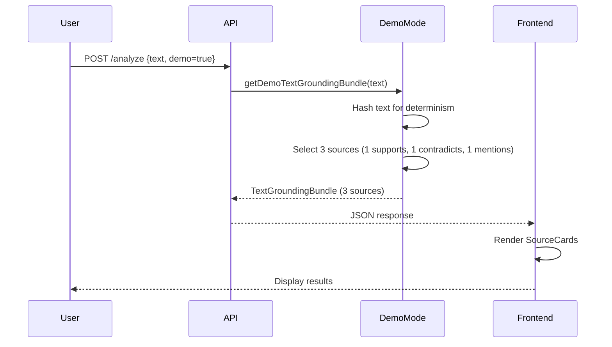
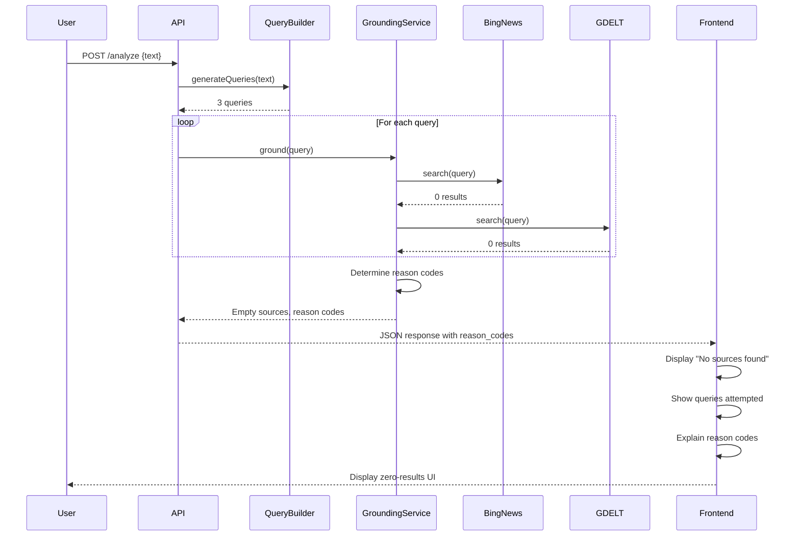
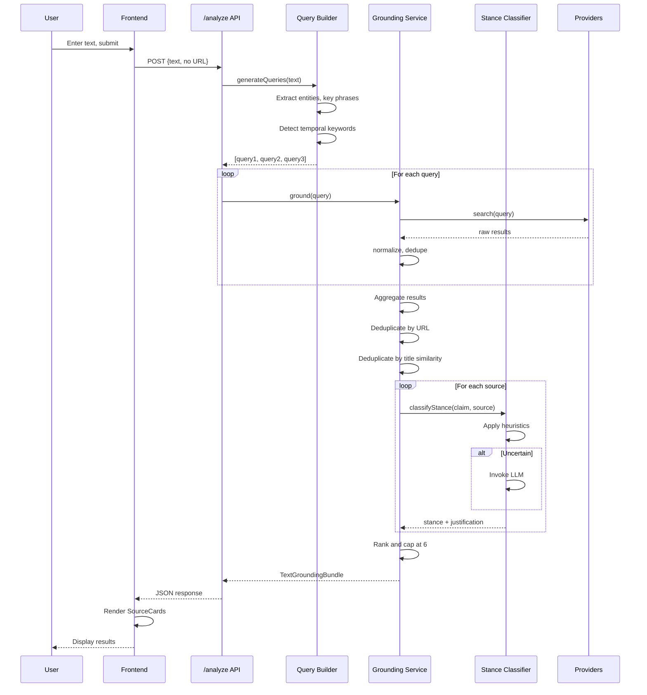

# Design Document: Text-Only Grounding

## Overview

The text-only grounding feature extends the existing real-time news grounding infrastructure to support fact-checking when users provide only text (no URL). The system automatically generates search queries from user text, retrieves sources from multiple providers with fallback logic, classifies stance relationships, and returns at least 3 sources when available.

This feature transforms the application from a URL-based fact-checker into a general-purpose claim verification tool, enabling users to fact-check statements, claims, and assertions without needing to find a URL first.

### Key Design Principles

1. **Leverage Existing Infrastructure**: Build on top of the proven groundingService, sourceNormalizer, and caching infrastructure
2. **Automatic Query Generation**: Extract searchable queries from natural language text using entity extraction and key phrase identification
3. **Multi-Provider Resilience**: Query multiple providers (Bing News, GDELT) with intelligent fallback logic
4. **Stance Classification**: Determine whether sources support, contradict, mention, or have unclear relation to the claim
5. **Graceful Degradation**: Handle zero-results scenarios with helpful feedback and reason codes
6. **Demo Mode Consistency**: Ensure demonstrations always show 3 sources with varied stances

## Architecture

### High-Level Architecture

```mermaid
graph TB
    User[User Input: Text Only]
    API[/analyze Endpoint]
    QueryBuilder[Query Builder]
    GroundingService[Grounding Service]
    StanceClassifier[Stance Classifier]
    Cache[Grounding Cache]
    BingNews[Bing News API]
    GDELT[GDELT API]
    DemoMode[Demo Mode]
    Frontend[Results Page]
    
    User -->|text, no URL| API
    API --> QueryBuilder
    QueryBuilder -->|3-6 queries| GroundingService
    GroundingService --> Cache
    Cache -->|miss| GroundingService
    GroundingService -->|query 1-N| BingNews
    BingNews -->|<3 results or fail| GroundingService
    GroundingService -->|fallback| GDELT
    GroundingService -->|normalize| StanceClassifier
    StanceClassifier -->|classify stance| GroundingService
    GroundingService -->|dedupe, rank| API
    API -->|demo mode?| DemoMode
    DemoMode -->|3 deterministic sources| API
    API -->|JSON response| Frontend
    Frontend -->|render| User
    
    style QueryBuilder fill:#e1f5ff
    style StanceClassifier fill:#e1f5ff
    style GroundingService fill:#fff4e1
    style Cache fill:#f0f0f0
```

### Integration with Existing Infrastructure

The text-only grounding feature integrates with existing components:

- **groundingService.ts**: Extended to accept multiple queries and aggregate results
- **sourceNormalizer.ts**: Reused for normalization, deduplication, and ranking
- **queryExtractor.ts**: Extended with new query generation capabilities
- **demoGrounding.ts**: Extended to support text-only demo scenarios
- **groundingCache.ts**: Reused without modification (caches by query)
- **grounding.ts types**: Extended with new stance and reason code types
- **backend-schemas.ts**: Extended with new API response fields

### Request Flow

1. User submits text-only request to `/analyze` endpoint
2. API detects no URL provided, triggers text-only grounding path
3. Query Builder generates 3-6 search queries from text
4. Grounding Service queries providers with each query
5. Source Normalizer transforms provider results to NormalizedSource
6. Stance Classifier determines relationship to claim
7. Deduplication removes duplicate URLs and similar titles
8. Ranking orders by relevance, credibility, recency, diversity
9. API returns 3-6 sources with metadata
10. Frontend renders SourceCard components with stance badges

## Components and Interfaces

### Query Builder

**Purpose**: Generate effective search queries from natural language text

**Location**: `backend/src/utils/queryBuilder.ts` (new file)

**Key Responsibilities**:
- Extract named entities (people, places, organizations)
- Identify key phrases and quoted claims
- Detect temporal keywords and add recency hints
- Generate 3-6 diverse queries per request
- Parse queries into structured QueryRequest objects
- Format QueryRequest objects back to search strings

**Interface**:

```typescript
interface QueryRequest {
  /** Main claim or assertion */
  claim: string;
  /** Named entities extracted from text */
  entities: string[];
  /** Key phrases for search */
  keyPhrases: string[];
  /** Temporal keywords detected */
  temporalKeywords: string[];
  /** Whether to prioritize recent results */
  recencyHint: boolean;
}

interface QueryGenerationResult {
  /** Generated search queries (3-6) */
  queries: string[];
  /** Structured query request */
  queryRequest: QueryRequest;
  /** Quality score (0-1) */
  qualityScore: number;
}

/**
 * Generate search queries from user text
 */
function generateQueries(text: string): QueryGenerationResult;

/**
 * Parse text into structured QueryRequest
 */
function parseQueryRequest(text: string): QueryRequest;

/**
 * Format QueryRequest back to search string
 */
function formatQuery(request: QueryRequest): string;
```

**Query Generation Strategy**:

1. **Entity-focused query**: Extract named entities and combine with main claim
2. **Quoted claim query**: Wrap main assertion in quotes for exact matching
3. **Key phrase query**: Combine top 3-5 key phrases
4. **Temporal query**: Add recency keywords if temporal context detected
5. **Broad query**: Use full text with stop words removed
6. **Variation query**: Rephrase using synonyms or related terms

**Example**:

Input: "The president announced a new climate policy yesterday"

Generated queries:
1. "president climate policy announcement"
2. "\"new climate policy\" president"
3. "climate policy president recent"
4. "president climate announcement yesterday"
5. "climate policy government announcement"
6. "president environmental policy 2024"

### Stance Classifier

**Purpose**: Determine whether a source supports, contradicts, mentions, or has unclear relation to the claim

**Location**: `backend/src/services/stanceClassifier.ts` (new file)

**Key Responsibilities**:
- Apply keyword-based heuristics first (fast path)
- Invoke LLM for uncertain cases (slow path)
- Generate 1-sentence justification for each classification
- Handle edge cases (satire, opinion, unclear)

**Interface**:

```typescript
type Stance = 'supports' | 'contradicts' | 'mentions' | 'unclear';

interface StanceResult {
  /** Classified stance */
  stance: Stance;
  /** 1-sentence justification */
  justification: string;
  /** Confidence score (0-1) */
  confidence: number;
  /** Whether LLM was invoked */
  usedLLM: boolean;
}

/**
 * Classify stance of source relative to claim
 */
async function classifyStance(
  claim: string,
  source: NormalizedSource
): Promise<StanceResult>;
```

**Classification Strategy**:

1. **Keyword Heuristics** (fast path):
   - Support keywords: "confirms", "proves", "supports", "validates", "shows", "demonstrates"
   - Contradiction keywords: "false", "debunked", "denies", "contradicts", "refutes", "disputes"
   - If strong signal detected, return immediately

2. **LLM Classification** (slow path):
   - Prompt: "Does this source [support/contradict/mention] the claim: {claim}?"
   - Context: source title + snippet
   - Return: stance + justification

3. **Edge Cases**:
   - Satire/parody: Classify as "unclear" with justification
   - Opinion pieces: Classify based on opinion stance
   - Insufficient context: Classify as "mentions"

### Enhanced Grounding Service

**Purpose**: Orchestrate multi-query grounding with stance classification

**Location**: `backend/src/services/groundingService.ts` (extended)

**New Method**:

```typescript
/**
 * Ground text-only claim with multiple queries
 */
async function groundTextOnly(
  text: string,
  requestId?: string,
  demoMode = false
): Promise<TextGroundingBundle>;

interface TextGroundingBundle extends GroundingBundle {
  /** Queries that were executed */
  queries: string[];
  /** Reason codes if zero results */
  reasonCodes?: ReasonCode[];
  /** Sources with stance classification */
  sources: NormalizedSourceWithStance[];
}

interface NormalizedSourceWithStance extends NormalizedSource {
  /** Stance relative to claim */
  stance: Stance;
  /** Stance justification */
  stanceJustification: string;
  /** Provider that returned this source */
  provider: string;
  /** Credibility tier (1-3) */
  credibilityTier: number;
}

type ReasonCode = 
  | 'PROVIDER_EMPTY'      // Providers returned zero results
  | 'QUERY_TOO_VAGUE'     // Query generation produced low-quality queries
  | 'KEYS_MISSING';       // Required API keys not configured
```

**Algorithm**:

```
1. Generate 3-6 queries from text using Query Builder
2. For each query:
   a. Check cache
   b. Query Bing News (N=10)
   c. If <3 results, query GDELT (N=10)
3. Aggregate all results across queries
4. Normalize to NormalizedSource format
5. Deduplicate by URL (exact match)
6. Deduplicate by title+publisher similarity (>80% match)
7. Classify stance for each source
8. Rank by: relevance (0.3) + credibility (0.3) + recency (0.2) + diversity (0.2)
9. Cap at 6 sources
10. Return at least 3 sources if available
11. If zero results, populate reason codes
```

### Source Normalizer Extensions

**Purpose**: Add credibility tier and stance fields to normalized sources

**Location**: `backend/src/services/sourceNormalizer.ts` (extended)

**New Functions**:

```typescript
/**
 * Assign credibility tier based on domain
 */
function assignCredibilityTier(domain: string): number;

/**
 * Calculate title similarity using Jaccard index
 */
function calculateTitleSimilarity(title1: string, title2: string): number;

/**
 * Deduplicate by title and publisher similarity
 */
function deduplicateByTitleSimilarity(
  sources: NormalizedSource[],
  threshold: number = 0.8
): NormalizedSource[];
```

**Credibility Tiers**:

- **Tier 1** (score 1.0): reuters.com, apnews.com, bbc.com, nytimes.com, washingtonpost.com, wsj.com, npr.org
- **Tier 2** (score 0.7): cnn.com, theguardian.com, bloomberg.com, politico.com, axios.com
- **Tier 3** (score 0.4): All other domains

### Demo Mode Extensions

**Purpose**: Support text-only demo scenarios with deterministic sources

**Location**: `backend/src/utils/demoGrounding.ts` (extended)

**New Function**:

```typescript
/**
 * Get demo grounding bundle for text-only request
 */
function getDemoTextGroundingBundle(text: string): TextGroundingBundle;
```

**Demo Strategy**:
- Always return exactly 3 sources
- Include varied stances: 1 supports, 1 contradicts, 1 mentions
- Use realistic metadata (titles, snippets, dates)
- Deterministic based on text hash
- Bypass external provider calls

## Data Models

### Extended NormalizedSource

```typescript
interface NormalizedSourceWithStance extends NormalizedSource {
  /** Stance relative to claim */
  stance: 'supports' | 'contradicts' | 'mentions' | 'unclear';
  
  /** 1-sentence stance justification */
  stanceJustification: string;
  
  /** Provider that returned this source */
  provider: 'bing' | 'gdelt' | 'demo';
  
  /** Credibility tier (1-3) */
  credibilityTier: number;
}
```

### TextGroundingBundle

```typescript
interface TextGroundingBundle {
  /** Sources with stance classification */
  sources: NormalizedSourceWithStance[];
  
  /** Queries that were executed */
  queries: string[];
  
  /** Providers used */
  providerUsed: string[];
  
  /** Total latency in milliseconds */
  latencyMs: number;
  
  /** Source count */
  sourcesCount: number;
  
  /** Whether result came from cache */
  cacheHit: boolean;
  
  /** Reason codes if zero results */
  reasonCodes?: ReasonCode[];
  
  /** Any errors encountered */
  errors?: string[];
}
```

### API Response Extensions

```typescript
interface AnalysisResponse {
  // ... existing fields ...
  
  /** Grounding metadata (extended) */
  grounding?: {
    /** Queries executed */
    queries: string[];
    
    /** Providers used */
    provider_used: string[];
    
    /** Source count */
    sources_count: number;
    
    /** Cache hit */
    cache_hit: boolean;
    
    /** Reason codes if zero results */
    reason_codes?: ReasonCode[];
    
    /** Latency in milliseconds */
    latency_ms: number;
  };
  
  /** Sources with stance (replaces credible_sources) */
  sources: Array<{
    url: string;
    title: string;
    snippet: string;
    domain: string;
    published_at?: string;
    stance: 'supports' | 'contradicts' | 'mentions' | 'unclear';
    stance_justification: string;
    provider: string;
    credibility_tier: number;
  }>;
}
```

## Data Flow Diagrams

### Text-Only Grounding Flow



### Demo Mode Flow



### Zero Results Flow



## API Contract Updates

### POST /analyze Endpoint

**Request** (text-only):

```json
{
  "text": "The president announced a new climate policy yesterday",
  "url": null
}
```

**Response** (success with sources):

```json
{
  "request_id": "uuid",
  "status_label": "Unverified",
  "confidence_score": 75,
  "recommendation": "Multiple sources found. Review stance indicators.",
  "sources": [
    {
      "url": "https://reuters.com/article1",
      "title": "President unveils climate initiative",
      "snippet": "The president announced sweeping climate reforms...",
      "domain": "reuters.com",
      "published_at": "2024-03-01T10:00:00Z",
      "stance": "supports",
      "stance_justification": "Article confirms the announcement with direct quotes",
      "provider": "bing",
      "credibility_tier": 1
    },
    {
      "url": "https://bbc.com/article2",
      "title": "Climate policy announcement disputed by experts",
      "snippet": "Environmental scientists question the effectiveness...",
      "domain": "bbc.com",
      "published_at": "2024-03-01T12:00:00Z",
      "stance": "contradicts",
      "stance_justification": "Article disputes the policy's effectiveness",
      "provider": "bing",
      "credibility_tier": 1
    },
    {
      "url": "https://npr.org/article3",
      "title": "White House press briefing covers multiple topics",
      "snippet": "The press secretary discussed climate, economy...",
      "domain": "npr.org",
      "published_at": "2024-03-01T14:00:00Z",
      "stance": "mentions",
      "stance_justification": "Article mentions climate policy among other topics",
      "provider": "gdelt",
      "credibility_tier": 1
    }
  ],
  "grounding": {
    "queries": [
      "president climate policy announcement",
      "\"new climate policy\" president",
      "climate policy president recent"
    ],
    "provider_used": ["bing", "gdelt"],
    "sources_count": 3,
    "cache_hit": false,
    "latency_ms": 1250
  },
  "timestamp": "2024-03-01T15:00:00Z"
}
```

**Response** (zero results):

```json
{
  "request_id": "uuid",
  "status_label": "Unverified",
  "confidence_score": 0,
  "recommendation": "No credible sources found. Try refining your query.",
  "sources": [],
  "grounding": {
    "queries": [
      "obscure claim nobody knows",
      "\"very specific niche topic\"",
      "niche topic recent"
    ],
    "provider_used": ["bing", "gdelt"],
    "sources_count": 0,
    "cache_hit": false,
    "reason_codes": ["PROVIDER_EMPTY"],
    "latency_ms": 850
  },
  "timestamp": "2024-03-01T15:00:00Z"
}
```

## Database/Cache Schema Updates

No database schema changes required. The existing grounding cache will work without modification:

- **Cache Key**: Normalized query string (lowercase, trimmed, whitespace normalized)
- **Cache Value**: GroundingBundle (extended with stance fields)
- **TTL**: 15 minutes (900 seconds)
- **Eviction**: LRU + TTL

The cache will naturally handle text-only queries since they're normalized to query strings before caching.

## Frontend Component Design

### SourceCard Component

**Purpose**: Display individual source with metadata and stance indicator

**Location**: `frontend/web/src/components/SourceCard.tsx` (new file)

**Props**:

```typescript
interface SourceCardProps {
  source: {
    url: string;
    title: string;
    snippet: string;
    domain: string;
    published_at?: string;
    stance: 'supports' | 'contradicts' | 'mentions' | 'unclear';
    stance_justification: string;
    provider: string;
    credibility_tier: number;
  };
}
```

**Visual Design**:

```
┌─────────────────────────────────────────────────────┐
│ [SUPPORTS]  reuters.com  •  Bing News  •  Tier 1   │
│                                                     │
│ President unveils climate initiative                │
│ https://reuters.com/article1                        │
│                                                     │
│ The president announced sweeping climate reforms... │
│                                                     │
│ Published: Mar 1, 2024 10:00 AM                    │
│ Why: Article confirms the announcement with direct  │
│      quotes                                         │
└─────────────────────────────────────────────────────┘
```

**Stance Badge Styling**:

- **Supports**: Green background, white text
- **Contradicts**: Red background, white text
- **Mentions**: Blue background, white text
- **Unclear**: Gray background, white text

### Zero Results Display

**Purpose**: Show helpful information when no sources found

**Location**: `frontend/web/src/components/ZeroResultsDisplay.tsx` (new file)

**Props**:

```typescript
interface ZeroResultsDisplayProps {
  queries: string[];
  reasonCodes: ReasonCode[];
}
```

**Visual Design**:

```
┌─────────────────────────────────────────────────────┐
│ No credible sources found                           │
│                                                     │
│ Queries attempted:                                  │
│ • president climate policy announcement             │
│ • "new climate policy" president                    │
│ • climate policy president recent                   │
│                                                     │
│ Why:                                                │
│ • Providers returned zero results                   │
│                                                     │
│ Try:                                                │
│ • Simplifying your query                            │
│ • Using different keywords                          │
│ • Checking spelling                                 │
└─────────────────────────────────────────────────────┘
```

**Reason Code Translations**:

- `PROVIDER_EMPTY`: "Providers returned zero results"
- `QUERY_TOO_VAGUE`: "Query was too vague to search effectively"
- `KEYS_MISSING`: "Search providers are not configured"

### Results Page Updates

**Purpose**: Integrate SourceCard and ZeroResultsDisplay components

**Location**: `frontend/web/src/pages/Results.tsx` (extended)

**Changes**:

```typescript
// Add source rendering
{response.sources && response.sources.length > 0 ? (
  <div className="sources-grid">
    {response.sources.map((source, index) => (
      <SourceCard key={index} source={source} />
    ))}
  </div>
) : (
  <ZeroResultsDisplay 
    queries={response.grounding?.queries || []}
    reasonCodes={response.grounding?.reason_codes || []}
  />
)}
```

## Sequence Diagrams

### Key Workflow: Text-Only Grounding with Stance Classification




## Error Handling

### Error Categories

1. **Query Generation Errors**
   - Empty text input → Return error response with 400 status
   - Query quality too low → Populate QUERY_TOO_VAGUE reason code, continue with best-effort queries
   - Entity extraction failure → Fall back to simple keyword extraction

2. **Provider Errors**
   - Bing API timeout → Fall back to GDELT
   - Bing API key missing → Skip Bing, try GDELT
   - GDELT timeout → Return partial results if any, otherwise empty with reason codes
   - All providers fail → Return empty sources with PROVIDER_EMPTY reason code

3. **Stance Classification Errors**
   - LLM timeout → Fall back to "unclear" stance with generic justification
   - LLM error → Fall back to "unclear" stance with generic justification
   - Invalid stance value → Default to "unclear"

4. **Deduplication Errors**
   - URL parsing failure → Skip that source
   - Title similarity calculation error → Skip similarity check, keep source

5. **Cache Errors**
   - Cache read failure → Log warning, proceed without cache
   - Cache write failure → Log warning, return results anyway

### Error Response Format

```json
{
  "request_id": "uuid",
  "status_label": "Unverified",
  "confidence_score": 0,
  "recommendation": "Unable to verify claim. See details below.",
  "sources": [],
  "grounding": {
    "queries": ["attempted query 1", "attempted query 2"],
    "provider_used": ["bing", "gdelt"],
    "sources_count": 0,
    "cache_hit": false,
    "reason_codes": ["PROVIDER_EMPTY"],
    "latency_ms": 850,
    "errors": ["Bing: timeout after 3500ms", "GDELT: timeout after 3500ms"]
  },
  "timestamp": "2024-03-01T15:00:00Z"
}
```

### Fallback Strategies

1. **Provider Fallback Chain**:
   - Try Bing News first (if API key available)
   - If Bing returns <3 results or fails, try GDELT
   - If both fail, return empty with reason codes

2. **Stance Classification Fallback**:
   - Try keyword heuristics first (fast)
   - If uncertain, try LLM (slow)
   - If LLM fails, default to "unclear" stance

3. **Query Generation Fallback**:
   - Try entity extraction first
   - If entities insufficient, use key phrase extraction
   - If key phrases insufficient, use full text with stop words removed

4. **Cache Fallback**:
   - Try cache read first
   - If cache miss or error, proceed with provider calls
   - If cache write fails, log warning but return results

## Performance Considerations

### Latency Budget

- **Total target latency**: <2000ms for text-only grounding
- **Query generation**: <100ms
- **Provider calls**: <1500ms (parallel execution)
- **Stance classification**: <300ms (parallel for all sources)
- **Deduplication and ranking**: <100ms

### Optimization Strategies

1. **Parallel Provider Queries**:
   - Execute all queries in parallel using Promise.all()
   - Set timeout of 3500ms per provider call
   - Aggregate results as they arrive

2. **Parallel Stance Classification**:
   - Classify all sources in parallel
   - Use keyword heuristics first (fast path)
   - Only invoke LLM for uncertain cases

3. **Early Termination**:
   - If first query returns 6+ high-quality sources, skip remaining queries
   - If cache hit, skip all provider calls

4. **Batch LLM Calls**:
   - If multiple sources need LLM classification, batch them into single request
   - Use streaming responses to reduce latency

5. **Smart Caching**:
   - Cache by normalized query (not full text)
   - TTL of 15 minutes for news content
   - LRU eviction for memory management

### Caching Strategy

**Cache Key Format**:
```
text-grounding:{normalized_query_hash}
```

**Cache Value**:
```typescript
{
  sources: NormalizedSourceWithStance[],
  queries: string[],
  providerUsed: string[],
  latencyMs: number,
  timestamp: string
}
```

**Cache Behavior**:
- **Read**: Check cache before any provider calls
- **Write**: Store results after successful grounding
- **TTL**: 900 seconds (15 minutes)
- **Eviction**: LRU + TTL
- **Max entries**: 1000

**Cache Hit Optimization**:
- If cache hit, return immediately (latency <10ms)
- Set `cacheHit: true` in response
- Update cache age on hit (LRU behavior)

### Scalability Considerations

1. **Rate Limiting**:
   - Bing News API: 1000 calls/month (free tier)
   - GDELT API: No rate limit (public)
   - Implement exponential backoff for rate limit errors

2. **Concurrent Requests**:
   - Support up to 100 concurrent text-only grounding requests
   - Use connection pooling for HTTP clients
   - Implement request queuing if needed

3. **Memory Management**:
   - Cache max size: 1000 entries (~10MB)
   - LRU eviction prevents unbounded growth
   - Clear cache on deployment

4. **Provider Quotas**:
   - Monitor Bing API usage
   - Fall back to GDELT when approaching quota
   - Alert when quota >80% consumed

## Correctness Properties

*A property is a characteristic or behavior that should hold true across all valid executions of a system—essentially, a formal statement about what the system should do. Properties serve as the bridge between human-readable specifications and machine-verifiable correctness guarantees.*

### Property 1: Text-only requests trigger query generation

*For any* request with non-empty text and no URL, the system should generate between 3 and 6 search queries.

**Validates: Requirements 1.1, 1.2**

### Property 2: Temporal keywords trigger recency hints

*For any* text containing temporal keywords (yesterday, today, recent, breaking, latest), at least one generated query should include recency hints or temporal context.

**Validates: Requirements 1.3**

### Property 3: Query builder extracts entities and key phrases

*For any* non-empty text input, the query builder should extract at least one named entity or key phrase, or use the full text if extraction yields nothing.

**Validates: Requirements 1.4**

### Property 4: Query builder includes quoted phrases

*For any* text with an identifiable main claim, at least one generated query should contain quoted phrases around the claim.

**Validates: Requirements 1.5**

### Property 5: Provider fallback on insufficient results

*For any* query where Bing News returns fewer than 3 results, the system should query GDELT as fallback.

**Validates: Requirements 2.2**

### Property 6: URL deduplication

*For any* set of sources with duplicate URLs (after normalization), the final result set should contain each unique URL at most once.

**Validates: Requirements 2.3**

### Property 7: Title similarity deduplication

*For any* set of sources where two sources have >80% title similarity and the same publisher, only one should appear in the final result set.

**Validates: Requirements 2.4**

### Property 8: Provider results normalized

*For any* provider-specific result (Bing or GDELT), the normalization function should produce a valid NormalizedSource object with all required fields populated.

**Validates: Requirements 2.5, 4.1-4.9**

### Property 9: Minimum source guarantee

*For any* grounding request where providers return 3 or more unique sources, the final result set should contain at least 3 sources.

**Validates: Requirements 3.1**

### Property 10: Source ranking order

*For any* set of sources, the final result set should be ordered by descending score, where score is calculated from relevance, credibility, recency, and diversity.

**Validates: Requirements 3.2**

### Property 11: Domain diversity

*For any* final result set with 4 or more sources, at least 3 different domains should be represented (unless fewer unique domains are available).

**Validates: Requirements 3.3**

### Property 12: Result count bounds

*For any* successful grounding request, the final result set should contain between 3 and 6 sources (or 0 if no sources found).

**Validates: Requirements 3.5**

### Property 13: Stance classification validity

*For any* classified source, the stance field should be one of: supports, contradicts, mentions, unclear.

**Validates: Requirements 4.8, 5.3**

### Property 14: Stance justification length

*For any* classified source, the stance justification should be at most 1 sentence (at most 1 period character).

**Validates: Requirements 5.4**

### Property 15: Support keyword detection

*For any* source where the title or snippet contains support keywords (confirms, proves, supports, validates, shows, demonstrates), the keyword-based heuristic should detect them.

**Validates: Requirements 5.5**

### Property 16: Contradiction keyword detection

*For any* source where the title or snippet contains contradiction keywords (false, debunked, denies, contradicts, refutes, disputes), the keyword-based heuristic should detect them.

**Validates: Requirements 5.6**

### Property 17: API response structure for text-only requests

*For any* text-only request, the API response should include a sources array, grounding.queries array, grounding.provider_used array, grounding.sources_count field, and grounding.cache_hit field.

**Validates: Requirements 6.1, 6.2, 6.3, 6.4, 6.5**

### Property 18: Zero results reason codes

*For any* text-only request where no sources are found, the API response should include grounding.reason_codes array with at least one reason code.

**Validates: Requirements 6.6, 7.3**

### Property 19: Zero results metadata

*For any* text-only request where providers return zero results, the API response should have an empty sources array and a populated grounding.queries array.

**Validates: Requirements 7.1, 7.2**

### Property 20: Demo mode determinism

*For any* text input, running demo mode twice with the same input should produce identical sources (same URLs, titles, stances).

**Validates: Requirements 8.4**

### Property 21: Demo mode source count

*For any* text input in demo mode, the system should return exactly 3 sources.

**Validates: Requirements 8.1**

### Property 22: Demo mode stance diversity

*For any* text input in demo mode, the 3 returned sources should include at least 2 different stance values.

**Validates: Requirements 8.2**

### Property 23: SourceCard rendering

*For any* non-empty sources array, the Results page should render one SourceCard component per source.

**Validates: Requirements 9.1**

### Property 24: SourceCard displays required fields

*For any* SourceCard, the rendered output should include the title as a link, publisher name, snippet text, stance badge, and provider tag.

**Validates: Requirements 9.2, 9.3, 9.5, 9.6, 9.7**

### Property 25: SourceCard conditional date display

*For any* source with a published_at field, the SourceCard should display the publication date; for sources without published_at, no date should be displayed.

**Validates: Requirements 9.4**

### Property 26: SourceCard stance styling

*For any* SourceCard, the stance badge should have distinct visual styling based on the stance value (supports=green, contradicts=red, mentions=blue, unclear=gray).

**Validates: Requirements 9.8**

### Property 27: Zero results queries display

*For any* zero-results response with grounding.queries populated, the Results page should display all queries in the "Queries attempted" section.

**Validates: Requirements 10.3**

### Property 28: Reason code translation

*For any* reason code in grounding.reason_codes, the Results page should display a user-friendly explanation (PROVIDER_EMPTY → "Providers returned zero results", etc.).

**Validates: Requirements 10.5**

### Property 29: Query parsing round-trip

*For any* valid QueryRequest object, parsing then formatting then parsing should produce an equivalent object (same entities, key phrases, temporal keywords).

**Validates: Requirements 13.6**

## Testing Strategy

### Dual Testing Approach

This feature requires both unit tests and property-based tests for comprehensive coverage:

- **Unit tests**: Verify specific examples, edge cases, error conditions, and integration points
- **Property tests**: Verify universal properties across all inputs using randomized testing

Together, these approaches provide comprehensive coverage: unit tests catch concrete bugs in specific scenarios, while property tests verify general correctness across the input space.

### Property-Based Testing

**Library**: fast-check (TypeScript/JavaScript property-based testing library)

**Configuration**:
- Minimum 100 iterations per property test
- Each test tagged with comment referencing design property
- Tag format: `// Feature: text-only-grounding, Property {number}: {property_text}`

**Example Property Test**:

```typescript
import fc from 'fast-check';

// Feature: text-only-grounding, Property 6: URL deduplication
test('URL deduplication removes duplicate URLs', () => {
  fc.assert(
    fc.property(
      fc.array(fc.webUrl(), { minLength: 5, maxLength: 20 }),
      (urls) => {
        // Create sources with duplicate URLs
        const sources = urls.map(url => ({
          url,
          title: 'Test',
          snippet: 'Test',
          publishDate: '2024-01-01T00:00:00Z',
          domain: 'test.com',
          score: 0.5
        }));
        
        // Deduplicate
        const deduplicated = deduplicate(sources);
        
        // Verify: each URL appears at most once
        const urlSet = new Set(deduplicated.map(s => s.url));
        expect(deduplicated.length).toBe(urlSet.size);
      }
    ),
    { numRuns: 100 }
  );
});
```

### Unit Testing Strategy

**Focus Areas**:
1. Query generation with specific text patterns
2. Provider fallback with mocked API responses
3. Stance classification with known support/contradiction keywords
4. Deduplication with specific duplicate scenarios
5. Zero results handling with empty provider responses
6. Demo mode with specific text inputs
7. API response structure validation
8. Frontend component rendering with specific props

**Example Unit Test**:

```typescript
// Unit test for provider fallback
test('falls back to GDELT when Bing returns <3 results', async () => {
  const mockBingClient = {
    search: jest.fn().mockResolvedValue([
      { name: 'Article 1', url: 'https://example.com/1', description: 'Test', datePublished: '2024-01-01T00:00:00Z', provider: [{ name: 'Example' }] }
    ])
  };
  
  const mockGDELTClient = {
    search: jest.fn().mockResolvedValue([
      { title: 'Article 2', url: 'https://example.com/2', seendate: '20240101000000', domain: 'example.com', language: 'en' },
      { title: 'Article 3', url: 'https://example.com/3', seendate: '20240101000000', domain: 'example.com', language: 'en' },
      { title: 'Article 4', url: 'https://example.com/4', seendate: '20240101000000', domain: 'example.com', language: 'en' }
    ])
  };
  
  const service = new GroundingService(mockBingClient, mockGDELTClient);
  const result = await service.groundTextOnly('test query');
  
  expect(mockBingClient.search).toHaveBeenCalled();
  expect(mockGDELTClient.search).toHaveBeenCalled();
  expect(result.sources.length).toBeGreaterThanOrEqual(3);
});
```

### Test Coverage Goals

- **Line coverage**: >90%
- **Branch coverage**: >85%
- **Function coverage**: >95%
- **Property test coverage**: All 29 properties implemented

### Integration Testing

**Scenarios**:
1. End-to-end text-only grounding with real providers (staging only)
2. Cache hit/miss scenarios
3. Demo mode consistency
4. Zero results handling
5. Frontend rendering with various source counts

### Performance Testing

**Benchmarks**:
- Query generation: <100ms for 95th percentile
- Text-only grounding: <2000ms for 95th percentile
- Stance classification: <300ms for 95th percentile
- Cache hit latency: <10ms for 95th percentile

**Load Testing**:
- 100 concurrent text-only requests
- Sustained load of 10 requests/second
- Memory usage <500MB under load

## Implementation Notes

### Phase 1: Core Infrastructure (Backend)

1. Create `queryBuilder.ts` with query generation logic
2. Create `stanceClassifier.ts` with keyword heuristics and LLM fallback
3. Extend `groundingService.ts` with `groundTextOnly()` method
4. Extend `sourceNormalizer.ts` with credibility tier and title similarity
5. Extend `demoGrounding.ts` with text-only demo support
6. Update `grounding.ts` types with new interfaces
7. Update `backend-schemas.ts` with new Zod schemas

### Phase 2: API Integration

1. Update `/analyze` endpoint to detect text-only requests
2. Add query generation step before grounding
3. Add stance classification step after grounding
4. Update response format with new fields
5. Add reason code logic for zero results

### Phase 3: Frontend Components

1. Create `SourceCard.tsx` component
2. Create `ZeroResultsDisplay.tsx` component
3. Update `Results.tsx` to use new components
4. Add stance badge styling
5. Add reason code translations

### Phase 4: Testing

1. Write property tests for all 29 properties
2. Write unit tests for query generation
3. Write unit tests for stance classification
4. Write unit tests for deduplication
5. Write integration tests for end-to-end flow
6. Write frontend component tests

### Phase 5: Performance Optimization

1. Implement parallel provider queries
2. Implement parallel stance classification
3. Add early termination logic
4. Optimize cache key generation
5. Add performance monitoring

### Dependencies

**New NPM Packages**:
- None (use existing dependencies)

**Existing Dependencies**:
- `fast-check`: Property-based testing
- `zod`: Schema validation
- `lru-cache`: Caching
- `psl`: Domain parsing
- `url-parse`: URL parsing

### Migration Strategy

**Backward Compatibility**:
- Existing URL-based grounding continues to work unchanged
- New text-only grounding is additive (no breaking changes)
- API response format is extended (not replaced)

**Rollout Plan**:
1. Deploy backend changes (text-only grounding available but not used)
2. Deploy frontend changes (UI supports text-only input)
3. Enable text-only grounding in production
4. Monitor performance and error rates
5. Iterate based on feedback

### Monitoring and Observability

**Metrics to Track**:
- Text-only grounding request count
- Query generation latency (p50, p95, p99)
- Provider call latency (p50, p95, p99)
- Stance classification latency (p50, p95, p99)
- Cache hit rate
- Zero results rate
- Reason code distribution
- Provider fallback rate

**Logs to Emit**:
- Query generation start/complete
- Provider call start/complete/error
- Stance classification start/complete/error
- Cache hit/miss
- Zero results with reason codes
- Demo mode usage

**Alerts to Configure**:
- Text-only grounding latency >3000ms (p95)
- Zero results rate >50%
- Provider error rate >10%
- Cache hit rate <30%
- Demo mode usage in production (unexpected)

## Open Questions

1. **LLM for stance classification**: Which LLM should we use? OpenAI GPT-4? Claude? Local model?
   - **Recommendation**: Start with OpenAI GPT-3.5-turbo for cost/speed balance, upgrade to GPT-4 if accuracy insufficient

2. **Query generation quality threshold**: What quality score should trigger QUERY_TOO_VAGUE?
   - **Recommendation**: Quality score <0.3 (based on entity count, key phrase count, text length)

3. **Title similarity threshold**: What threshold for title deduplication?
   - **Recommendation**: 80% Jaccard similarity (can tune based on testing)

4. **Stance classification confidence threshold**: When should we fall back to LLM?
   - **Recommendation**: If keyword heuristic confidence <0.7, invoke LLM

5. **Domain diversity enforcement**: Should we enforce max sources per domain?
   - **Recommendation**: No hard limit, but use diversity score in ranking to naturally spread across domains

6. **Cache invalidation**: Should we support manual cache invalidation?
   - **Recommendation**: Not in MVP, add if needed based on user feedback

7. **Query generation strategy**: Should we use NLP libraries or simple heuristics?
   - **Recommendation**: Start with simple heuristics (regex, stop words), upgrade to NLP if quality insufficient

## Future Enhancements

1. **Advanced Query Generation**:
   - Use NLP library (spaCy, compromise) for better entity extraction
   - Add query expansion with synonyms
   - Add query refinement based on initial results

2. **Improved Stance Classification**:
   - Train custom stance classification model
   - Add confidence scores to stance results
   - Support multi-label stance (e.g., "partially supports")

3. **Enhanced Ranking**:
   - Add user feedback to ranking algorithm
   - Personalize ranking based on user preferences
   - Add source quality signals (fact-check ratings, bias scores)

4. **Source Enrichment**:
   - Add author information
   - Add article full text preview
   - Add related articles
   - Add fact-check verdicts from third-party services

5. **User Experience**:
   - Add source filtering by stance
   - Add source sorting options
   - Add source bookmarking
   - Add source sharing

6. **Performance**:
   - Add distributed caching (Redis)
   - Add request batching
   - Add result streaming
   - Add progressive loading

7. **Analytics**:
   - Track which queries produce best results
   - Track which sources users click most
   - Track stance distribution over time
   - Track zero results patterns

## Conclusion

The text-only grounding feature extends the existing real-time news grounding infrastructure to support claim verification without requiring a URL. By leveraging proven components (groundingService, sourceNormalizer, cache) and adding new capabilities (query generation, stance classification), we enable users to fact-check any text claim.

The design prioritizes:
- **Reliability**: Multi-provider fallback, graceful degradation, comprehensive error handling
- **Performance**: Parallel execution, smart caching, early termination
- **Usability**: Clear stance indicators, helpful zero-results feedback, consistent demo mode
- **Testability**: Property-based testing for universal properties, unit tests for specific scenarios
- **Maintainability**: Modular components, clear interfaces, comprehensive logging

This feature transforms the application from a URL-based fact-checker into a general-purpose claim verification tool, significantly expanding its utility and user base.
